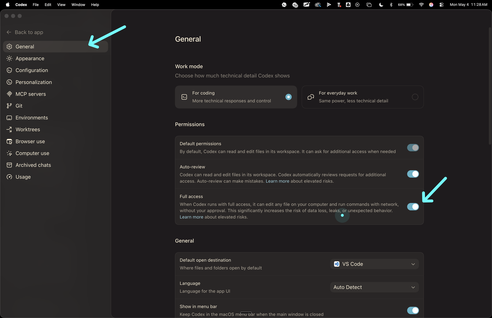
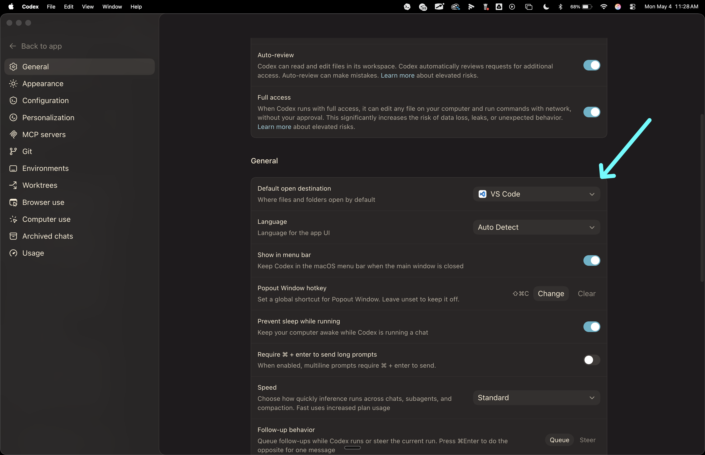
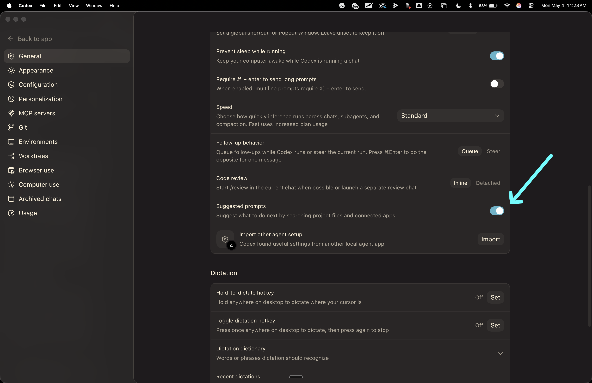
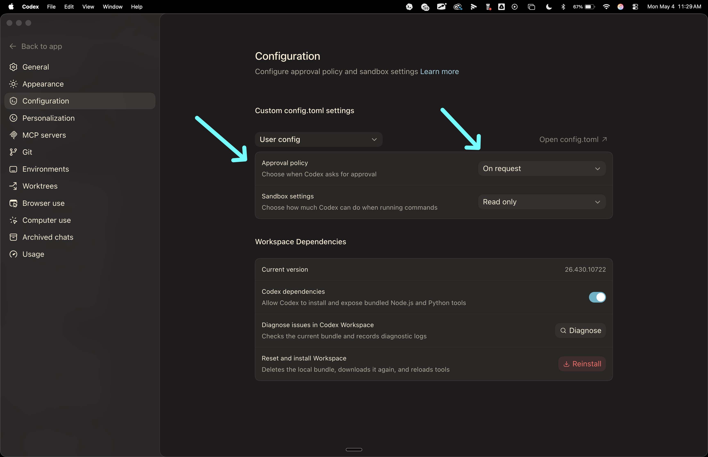
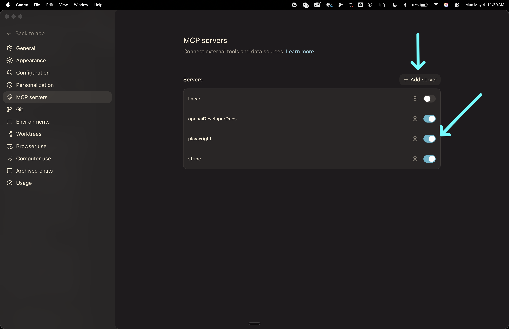
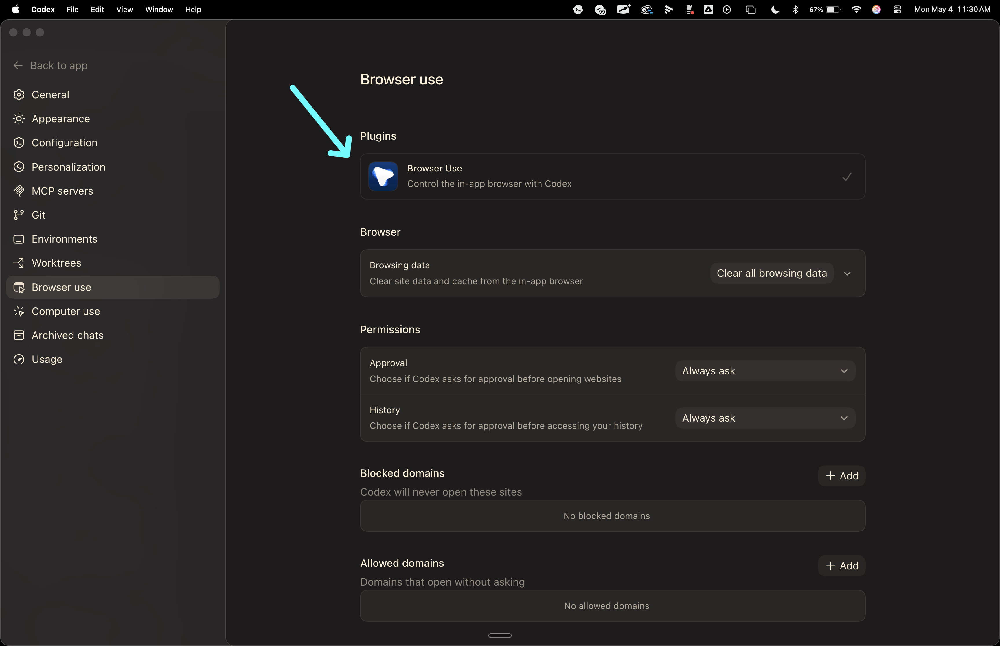
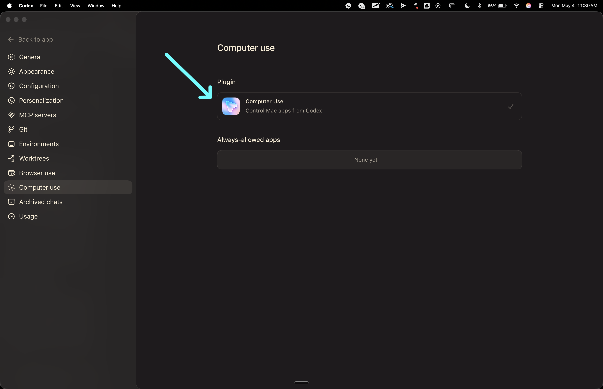
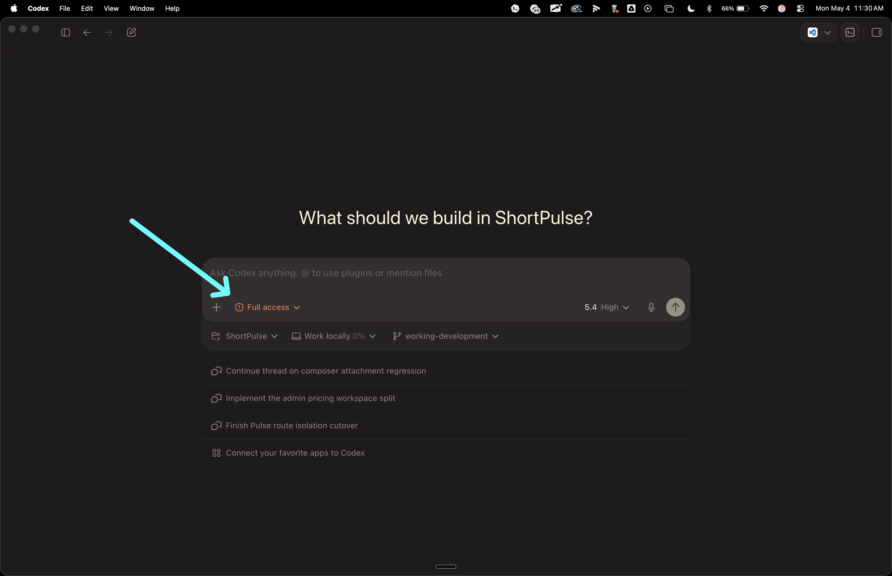

# Codex App Settings

Purpose: set Codex up for local repo work before training agents.

## 1. General Work Mode And Permissions

Open `Settings -> General`.

Set:
- Work mode: `For coding`
- Default permissions: `On`
- Auto-review: `On`
- Full access: `On`

## 2. General Operating Preferences

In `Settings -> General`, set:
- Default open destination: `VS Code`
- Prevent sleep while running: `On`

## 3. General Chat Behavior

In `Settings -> General`, set:
- Require Cmd + Enter to send long prompts: `Off`
- Speed: `Standard`
- Follow-up behavior: `Queue`
- Code review: `Inline`
- Suggested prompts: `On`

## 4. Configuration Defaults

Open `Settings -> Configuration`.

Set:
- Approval policy: `On request`
- Sandbox settings: `Read only`

These are the app defaults. Individual sessions can still be elevated later when needed.

## 5. MCP Servers

Open `Settings -> MCP servers`.

Enable the servers you actually use for the project. In the current teaching setup, the visible enabled examples are:
- `openaiDeveloperDocs`
- `playwright`
- `stripe`

Use `Add server` when a new external tool is required.

## 6. Browser Use

Open `Settings -> Browser use`.

Set:
- Browser Use plugin: enabled
- Approval: `Always ask`
- History: `Always ask`

## 7. Computer Use

Open `Settings -> Computer use`.

Set:
- Computer Use plugin: enabled

## 8. Session Controls In The Composer

Before starting a run, verify the composer controls:
- Access mode: `Full access`
- Model: `5.4 High` or above

These controls are set per working session, not only in app settings.

## Practical Note

The app defaults are the base layer. The composer session controls are the run-time layer. Check both before training or automating an agent.
