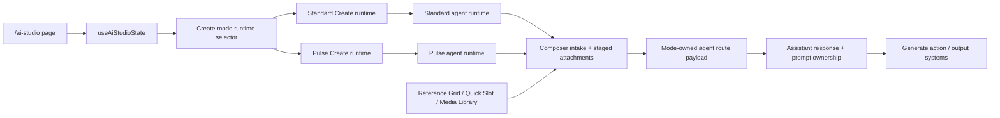

# Create Panel System Map

Purpose: provide a compact map of the systems that cooperate to make the AI Studio Create panel work, with emphasis on ownership boundaries, mode routing, composer intake, and the surrounding persistence/runtime seams.

## Core Idea

The Create panel is not one monolithic surface.

It is a coordinated system made of:

- page-level workspace/runtime orchestration
- mode-owned Create runtimes
- mode-specific agent runtimes
- a shared composer/reference intake lane
- reference surfaces that feed the composer
- output and session systems that surround, but do not own, ephemeral composer image refs

The safest debugging and implementation rule is:

- identify which system owns the current behavior before changing code

## Top-Level Flow

## System Inventory

### 1. Page Shell And Workspace Runtime

Primary owner:

- `frontend/pages/ai-studio.tsx`

Key job:

- assembles the full AI Studio page
- connects workspace state, panel runtimes, output handling, reference systems, and page chrome

Important rule:

- this layer orchestrates the systems, but it should not erase the Standard vs Pulse boundary

## 2. Core Create/Workspace State

Primary owner:

- `frontend/features/ai-studio/hooks/useAiStudioState.ts`

Key job:

- owns broad page state such as:
  - active mode
  - selected tool
  - prompt values
  - output collections
  - reference state
  - generation state
  - project/session authority

Important rule:

- this is the main state root, but not the single source of truth for mode-owned agent behavior

## 3. Mode Boundary Contract

Primary contract:

- `frontend/features/ai-studio/createRuntime/contracts.ts`

Key job:

- defines the hard boundary between Standard Create and Pulse Create
- prevents fallback into one shared prop bag that blurs mode-specific ownership

Important rule:

- if a change affects both Standard and Pulse, confirm whether the contract should stay split before sharing logic

## 4. Standard Create Runtime

Primary owners:

- `frontend/features/ai-studio/createRuntime/useStandardCreateAgentRuntime.ts`
- `frontend/features/ai-studio/createRuntime/buildStandardCreateRuntimeResult.ts`

Key job:

- owns Standard-mode chat state, prompt ownership, agent transport, and Standard-specific composer behavior

Standard mental model:

- assistant output is chat output first
- prompt text stays owned by the visible composer
- the assistant does not silently become the generation prompt

## 5. Pulse Create Runtime

Primary owners:

- `frontend/features/ai-studio/createRuntime/usePulseCreateAgentRuntime.ts`
- `frontend/features/ai-studio/createRuntime/buildPulseCreateRuntimeResult.ts`

Key job:

- owns Pulse-mode chat state, preset continuity, workflow session behavior, and Pulse-specific transport/runtime rules

Pulse mental model:

- preset/session continuity is part of the runtime
- workflow state is not just UI decoration
- Pulse should not leak its session assumptions back into Standard

## 6. Composer Intake And Staged Attachments

Primary owners:

- `frontend/features/ai-studio/hooks/useAiStudioAgentComposer.ts`
- `frontend/features/ai-studio/components/promptStep/agentComposerDrop.ts`
- `frontend/features/ai-studio/logic/composerImageAttachment.ts`
- `frontend/features/ai-studio/logic/agentAttachmentImage.ts`

Key job:

- accepts prompt/reference/image drops
- stages temporary attachments for the active chat/composer surface
- supports prompt insertion and image reference preparation for model vision

Current contract:

- chat-only
- ephemeral
- image-only for the small vision-reference lane
- not project-persistent
- not storage-promotion-driven

Critical rule:

- for internal app drags, prefer structured/internal/reference hints before raw browser `files`

## 7. Reference Feeders

Primary owners:

- `frontend/features/ai-studio/reference-grid/`
- `frontend/features/ai-studio/utils/dragDrop.ts`
- `frontend/features/ai-studio/logic/mediaLibraryDragPayload.ts`

Key job:

- produce the internal drag payloads that feed the composer
- preserve app-owned identity across Reference Grid, Quick Slot, and Media Library drags

Important rule:

- if desktop file drops work but internal drags fail, this is usually an intake-classification boundary problem, not a generic image-preview bug

## 8. Prompt/Chat Presentation Surfaces

Primary owners:

- `frontend/features/ai-studio/components/PromptStep.tsx`
- `frontend/features/ai-studio/components/promptStep/StandardPromptStepChatSurface.tsx`
- `frontend/features/ai-studio/components/promptStep/PulsePromptStepChatSurface.tsx`
- `frontend/features/ai-studio/components/PulsePromptStep.tsx`

Key job:

- render message history, composer UI, staged attachments, and send controls

Important rule:

- these surfaces present state; they are rarely the right first place to fix a source-classification or mode-routing bug

## 9. Attachment Preview Surface

Primary owners:

- `frontend/features/ai-studio/components/promptStep/AgentComposerAttachmentImage.tsx`
- `frontend/prefabs/agent/components/AgentImageAttachmentPreview.tsx`

Key job:

- renders staged attachment cards
- shows `preparing` before `ready`
- projects the preview side of a staged image attachment

Important rule:

- preview rendering is downstream of intake and staging
- if the preview is wrong, check whether the staged attachment object is wrong first

## 10. Output / Generation Bridge

Relevant owners:

- `frontend/features/ai-studio/hooks/useAiStudioAgentOutputGenerationBridge.ts`
- page-level generation/runtime hooks assembled by `frontend/pages/ai-studio.tsx`

Key job:

- bridges chat/runtime outcomes into the actual generation flow
- keeps prompt ownership explicit instead of letting chat output silently bypass the composer

Important rule:

- generation behavior is adjacent to the Create composer, but not the same system as ephemeral attachment intake

## 11. Project And Session Persistence Boundary

Relevant docs:

- `docs/adr/0070-project-workspace-conversational-runtime-exclusion.md`
- `docs/sops/sop_ai_studio_projects_foundation.md`

Key rule:

- project/workspace persistence is durable page state
- ephemeral composer image refs are temporary chat inputs

Do not collapse these systems when implementing or debugging.

## System Boundaries That Matter Most

### Standard vs Pulse

Shared page, separate runtime authority.

Do not assume:

- one agent route
- one session model
- one prompt-ownership model

### Internal Drag vs Desktop File Drop

Same visible action, different source authority.

Do not assume:

- `DataTransfer.files` means desktop upload
- degraded browser drags are generic drags

### Composer vs Project Persistence

Same page, different lifecycle.

Do not assume:

- staged composer image refs should persist to project state
- preview/storage recovery logic belongs in the ephemeral chat lane by default

### Preview vs Source Classification

Same symptom family, different root cause.

Do not assume:

- a dark or broken chip is primarily a rendering bug
- preview fixes are enough if intake classification is wrong upstream

## Fast Debugging Entry Points

If the issue is about:

- mode confusion:
  - start with `frontend/features/ai-studio/createRuntime/contracts.ts`
- Standard-only or Pulse-only behavior:
  - inspect the corresponding `useStandardCreateAgentRuntime.ts` or `usePulseCreateAgentRuntime.ts`
- internal drag/drop:
  - inspect `agentComposerDrop.ts`, `useAiStudioAgentComposer.ts`, and the drag payload producers
- attachment card rendering:
  - inspect `AgentComposerAttachmentImage.tsx` and `AgentImageAttachmentPreview.tsx`
- “why did this persist or restore?”:
  - inspect `useAiStudioState.ts` and the project/session persistence docs before touching the composer lane

## Recommended Read Order

1. `docs/agents/Create Workflow/create-panel-operating-brief.md`
2. this system map
3. `frontend/features/ai-studio/createRuntime/contracts.ts`
4. `frontend/pages/ai-studio.tsx`
5. the specific runtime or composer files for the active issue
