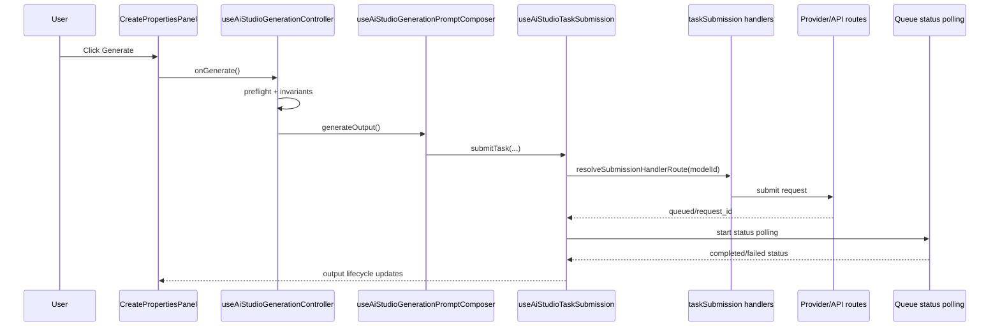

# SOP: AI Studio Create Properties And Generation Wiring

Purpose: document how the Create properties panel is wired to model selection, generation submission, and agent/control services so future work can stay behavior-safe.

## Scope

- In scope: AI Studio Create workflow wiring (`CreatePropertiesPanel`), model selectors/defaults, generate/regenerate submission pipeline, and agent + safety control service touchpoints.
- Out of scope: provider pricing policy changes, billing schema changes, and non-Create tool UI redesign.

## System map

| Layer                         | Source of truth                                                                                                                                                                                                                                                                                                                                                                                                                       | Responsibility                                                                                                                                                               |
| ----------------------------- | ------------------------------------------------------------------------------------------------------------------------------------------------------------------------------------------------------------------------------------------------------------------------------------------------------------------------------------------------------------------------------------------------------------------------------------- | ---------------------------------------------------------------------------------------------------------------------------------------------------------------------------- |
| Page orchestration            | `frontend/pages/ai-studio.tsx`                                                                                                                                                                                                                                                                                                                                                                                                        | Composes state hooks, performs the top-level Standard/Pulse runtime switch, and passes a discriminated mode-owned Create contract into the page.                             |
| Create runtime contracts      | `frontend/features/ai-studio/createRuntime/*`                                                                                                                                                                                                                                                                                                                                                                                         | Defines Standard/Pulse page agent runtime contracts and mode-owned panel result builders.                                                                                    |
| Create panel UI               | `frontend/features/ai-studio/components/create/StandardCreatePropertiesPanel.tsx` + `frontend/features/ai-studio/components/create/PulseCreatePropertiesPanel.tsx`                                                                                                                                                                                                                                                                    | Owns the mounted mode-specific composer modules below the page runtime switch.                                                                                               |
| Model option policy           | `frontend/features/ai-studio/logic/modelSelectionPolicy.ts` + `hooks/useAiStudioAllowedModelOptions.ts`                                                                                                                                                                                                                                                                                                                               | Computes policy-approved options by tool/mode/video-reference mode/character mode.                                                                                           |
| Model metadata                | `frontend/lib/model-runtime/modelCatalog.ts` + `frontend/lib/model-runtime/modelRegistry.ts`                                                                                                                                                                                                                                                                                                                                          | Canonical model capabilities, payload contracts, defaults, labels, and provider routing metadata.                                                                            |
| Submit orchestration          | `frontend/features/ai-studio/hooks/useAiStudioGenerationController.ts` + `useAiStudioGenerationPromptComposer.ts` + `useAiStudioTaskSubmission.ts`                                                                                                                                                                                                                                                                                    | Applies guardrails/preflight, composes prompt/reference inputs, starts provider submit + polling lifecycle.                                                                  |
| Submit handler routing        | `frontend/features/ai-studio/hooks/taskSubmission/routing.ts` + `taskSubmission/{defaultHandlers,imageHandlers,videoHandlers}.ts`                                                                                                                                                                                                                                                                                                     | Routes model ids to handler families and performs provider-specific payload submit logic.                                                                                    |
| Agent client runtimes         | `frontend/features/ai-studio/createRuntime/useStandardCreateAgentRuntime.ts`, `frontend/features/ai-studio/createRuntime/usePulseCreateAgentRuntime.ts`, `frontend/features/ai-agent/useCreateAgentStateCore.ts`, `frontend/features/ai-studio/hooks/createAgentRuntime/*`                                                                                                                                                            | Own lane-scoped chat state, attachment prep, transport binding, prompt application, and response parsing. Active Create must not use the legacy shared bridge.               |
| Agent runtime + control plane | `frontend/pages/api/ai/studio-agent-standard.ts`, `frontend/pages/api/ai/studio-agent-pulse.ts`, Standard runtime `frontend/features/agent-runtime/standardStudioAgentRuntime/runtime.ts`, Pulse runtime `frontend/features/agent-runtime/pulseStudioAgentRuntime/runtime.ts`, `frontend/pages/api/ai/extract-style.ts`, `frontend/lib/server/api/agentSafetyPolicyControlPlane.ts`, `frontend/pages/api/admin/agent-safety-policy/*` | Server-authoritative agent execution, lane boundary validation, safety precheck/profile resolution, style extraction intake, and admin activation/rollback/version controls. |

## Architecture diagrams

## Create properties panel wiring

1. `AiStudioPage` performs the top-level Create-mode render decision:

- Standard path: `StandardCreateRuntimeRoot` mounts Standard-owned agent runtime, chat-mode state, composer input, prompt setter, and generation commands. Standard Create now defaults chat mode off when no explicit Standard runtime value exists.
- Pulse path: `PulseCreateRuntimeRoot` mounts Pulse-owned preset/page runtime, agent runtime, workflow state, composer input, and prompt setter. Pulse remains chat-only and does not expose a direct Pulse-mode generate command.

2. `AiStudioPageRuntimeBody` and `AiStudioPageRuntimePresenter` consume one discriminated `CreatePageAgentRuntime` and build `propertiesCreate` from the active mode only.
3. `AiStudioPageContent` renders the matching Create panel:

- Standard path: `StandardCreatePropertiesPanel` owns Standard composer rendering.
- Pulse path: `PulseCreatePropertiesPanel` owns Pulse composer rendering and mounts `PulseCreatePanelView`.

4. Model picker open path is anchored with `anchorId="create-model"` and uses a Create-lane context resolver so modal ordering/filtering stays deterministic for Create:
   - Standard Create with Character Mode OFF -> `context="text-image"`
   - Standard Create with Character Mode ON -> `context="character-image"`
   - Pulse keeps Character Mode runtime-disabled and does not reuse the Standard Character Mode picker lane
5. Prompt step always routes through the same `PromptStep` contract. Standard Create exposes its inline `Generate` action only while Standard Chat Mode is OFF; when Standard Chat Mode is ON, that inline action is suppressed and assistant output must be dragged into the composer before it can drive generation. Pulse keeps the same composer and text-entry surface for chat, but does not expose a Pulse-only Generate CTA. When a Create panel is using `agentAttachmentDropTarget="input"`, text-only drops anywhere inside the open Create composer zone must route through the same composer-text insertion path as the visible textarea itself; only true media drops should continue into the attachment pipeline. In both Create modes, a long draft that expands the composer must remain expanded when focus leaves the textarea; outside clicks are not an auto-collapse trigger while draft content remains.
6. Character mode and character picker are controlled by `useCreateCharacterModeController`; selection state remains in page-level orchestration.
7. Character Mode app-owned look refs do not persist as durable signed URLs through generation/replay handoff. When storage authority is known, the Create lane must pass canonical internal media refs into the shared image/edit submit contract so provider-facing `image_urls` are minted at submit time.
8. In Create `Standard` mode, the composer leading slot mounts the shared `StylesControl` only while Standard Chat Mode is OFF; it toggles the right-rail Styles section and uses `AiStudioPageContent` shared state (`isStylesPanelOpen`, `selectedStyleId`) so Create/Edit surfaces stay in sync. When Standard Chat Mode is ON, the Create-only control set is hidden from the panel and any open Create-owned Styles/model/character picker UI must close instead of remaining visible off to the side.
9. In Create `Pulse` mode, `PulseCreatePanelView` mounts `CreatePulsePresetPanel` in the left rail. Custom Pulse preferences are mounted through the Pulse-only `CreatePulsePreferenceProvider`, so Standard mode does not load saved custom Pulse definitions into active page state. That panel merges a shared catalog of built-in guided workflows plus curated per-user custom Pulse allocation from `user_preferences`, supports drag/drop from `CreatePulsePresetsSurface`, limits user editing to custom Pulses only, and activates a pinned preset by setting the current Pulse runtime selection instead of mutating the visible `agentInput` composer. `CreatePulsePresetsSurface` now serves both as a browse/pin surface and as a direct activation surface: clicking a Pulse there activates it immediately and pins it into the rail so the active owner remains visible. The library panel (`Libraries -> Presets -> Pulses`) remains catalog-management only and does not activate Pulses directly. Built-ins remain guided workflow compatibility records resolved from the admin control plane. User-authored custom Pulses are simpler: they are saved instruction presets whose runtime authority comes from `systemInstructions`, not from hidden workflow metadata. Retired Pulse metadata and built-in id collisions are discarded during preference normalization, and legacy custom Pulse records are normalized into the standalone `custom_gpt` contract instead of rehydrating hidden workflow fields. Built-in workflow runtime instructions are resolved authoritatively from the server control plane before `/api/ai/studio-agent-pulse` executes. Pulse is an agent-only lane: it does not read or own the Standard Create chat toggle, it uses the Pulse create runtime and `/api/ai/studio-agent-pulse`, it hides the inline chat-mode toggle, and it suppresses the shared `StylesControl` plus right-rail Styles toggle until the user switches back to `Standard`. Switching back to `Standard` now parks active Pulse runtime ownership instead of clearing it; returning to `Pulse` restores the parked session when preset/session authority is still valid.
10. Create-mode switching does not fork the shared workspace right rail. `Reference Grid`, `Quick Slot Inventory`, and `Canvas` remain page-global surfaces across `Standard` and `Pulse`, so mode switches keep one shared output focus and quick-slot/reference projection authority within the current workspace.
11. The right-side Agent Chat rail is retired. Create agent chat remains inside the active Create composer only; `AiStudioShellFrame` should not render a generic `AgentChatPanel` or accept a mixed `agentChat` contract.
12. Pulse runtime state is page/session-owned and threads into `/api/ai/studio-agent-pulse` as hidden runtime metadata. Standard agent traffic routes through `/api/ai/studio-agent-standard`, which rejects Pulse-shaped payloads. The workspace snapshot persists lane-specific `agentRuntimes` only; the legacy generic `agent` field is not a conversational restore authority. Standard-mode restore must fail closed against hidden Pulse runtime state in the visible Standard surface: it must not surface active Pulse ownership, `pulseWorkflowSession`, transcript state, draft agent input, `promptOrigin`, or the Standard Create chat-toggle preference inside Standard UI or Standard route requests. On project routes, authoritative preset/session ownership now allows the parked Pulse lane to restore alongside the Standard lane so users can return to the same active Pulse after reload.
13. Active Pulse sessions use the authoritative `pulseWorkflowSession` runtime state for guided status, step progression, and artifact completion, but the Create chat surface no longer renders separate Pulse session banner chrome. The visible workflow guidance should come from the assistant turns themselves, with the transcript remaining the primary surface the user reads during a Pulse. Project reload now restores authoritative parked Pulse runtime state instead of forcing a fresh activation, while still keeping hidden Pulse transcript/context out of visible Standard mode.
14. Active workspace prompt writes use the mounted mode-owned prompt setter. A Pulse draft can remain in Pulse state, but it must not appear in Standard composer input, Standard prompt state, Standard route requests, Standard snapshots, or Standard telemetry.

## Model selector and startup default pipeline

1. Allowed options are computed in `useAiStudioAllowedModelOptions` via `resolveAiStudioAllowedModelOptions`.
2. Policy constraints are enforced by workflow:

- Create image/text -> text-to-image capable image models.
- Edit/image -> image-to-image capable models.
- Video/kling/keyframes/motion -> mode-constrained image-to-video sets.
- Character mode in Create narrows to Character Mode-approved image-to-image-capable models, including GPT Image 2 and the paired Seedream/Nano Banana edit lanes.

3. `ModelModal` applies context-specific ordering (`providerPriorityByContext`, `modelPriorityByContext`) and context-specific hides (`hiddenModelIdsByContext`).
4. Selection commit path:

- `handleSelectModelFromModal` (`useAiStudioWorkspaceActions`) -> `setModel(value)` -> `closeModelModal()`.

5. Startup/default restore path:

- `useAiStudioWorkflowSettings` reads `aiStudioWorkflowSettingsByTool.v1`.
- Create startup model uses `resolveCreateWorkflowStartupModel` precedence.
- Edit startup model uses `resolveEditWorkflowStartupModel` precedence.
- Live workflow tab switches use the lightweight workflow-settings hook. Model selection remains workflow-local across tab switches. Non-project routes keep browser session persistence plus the shared aspect preference, while project routes suppress browser persistence and restore workflow-local model/aspect only for the active in-session project authority.

6. Guard effects:

- `useAiStudioStateEffects` clamps invalid aspect/resolution combinations and enforces video reference-mode/model compatibility transitions.
- In the Video Standard lane, adding a second frame must not auto-promote the workflow into hidden `keyframes` mode or force a compatible explicit model selection over to Veo. First/last-frame behavior stays Standard-owned for Veo, Kling 3.0, and Seedance 2, while legacy hidden `keyframes` snapshots are normalized back onto the visible Standard lane during restore.

## Generation pipeline (Create CTA to provider polling)

1. CTA event entry:

- `CreatePropertiesPanel.onGenerate` -> `useAiStudioGenerationController.handlePrimarySubmit`.

2. Create text-mode branch:

- Standard mode with chat mode on: send to the Standard chat lane through `/api/ai/studio-agent-standard`.
- Standard mode with chat mode off: bypass the Standard agent lane and submit direct generate from the authored/raw prompt path.
- Create `Pulse` mode override: Pulse is its own agent-only lane through `/api/ai/studio-agent-pulse`.

3. `handleGenerate` preflight:

- Revalidate credit coverage (`refreshBalance` path when needed).
- Evaluate start invariants (`resolveGenerationStartDecision`).
- Run character-mode preflight with 10s deadline and enforce reference invariants when character mode is active.

4. Prompt/reference composition:

- `useAiStudioGenerationPromptComposer.generateOutput` resolves tool-specific prompt + reference pool and calls `submitTask`.
- For Create/Edit workflows with a selected style, the composer appends the selected style prompt to the hidden submission prompt while preserving `displayPrompt` in UI/history.

5. Submission lifecycle in `useAiStudioTaskSubmission`:

- Re-check submit invariants (`submitInvariants.ts`).
- Create/reconcile optimistic placeholder output.
- Prepare reference URLs with dynamic deadline budgeting (`base 14s + 12s per extra work unit + 14s per local blob/data input`, capped at 120s) and abortable prep stages.
- Emit preflight stage breadcrumbs (`generation_preflight_prepare_stage`) per input role/index for timeout diagnostics.
- Build and persist `generationReplay` snapshot metadata.
- Resolve handler family (`resolveSubmissionHandlerRoute`) and invoke `handleVideoModelSubmission` / `handleImageModelSubmission` / `handleDefaultModelSubmission`.

6. Provider handoff handling:

- Queued response -> `startQueuedStatusPolling`.
- Dispatched response (`request_id`) -> patch output as running, start polling, and call `ensureGenerationRecord`.
- Submit-not-started/auth-timeout invariants fail fast and mark output failed with deterministic user error text.

## Style prompt append semantics and adherence expectations

1. Style behavior contract:

- Selected style prompt is appended as plain text to the hidden submission prompt, with model-family adaptation in the composer:
  - Nano Banana family: `Visual style reference (treatment only): <style>. Preserve subject identity and base composition.`
  - Seedream family: `Visual style reference: <style>. Emphasize cohesive palette, lighting mood, and surface texture.`
  - Generic fallback and adapter-disabled mode: `Visual style reference: <style prompt>`
- Visible prompt shown to the user remains unchanged (`displayPromptOverride` path).
- Source of truth:
  - `frontend/features/ai-studio/hooks/useAiStudioGenerationPromptComposer.ts`
  - `frontend/features/ai-studio/logic/stylePromptAdapter.ts`
  - `frontend/features/ai-studio/components/AiStudioPageContent.tsx`
- Runtime kill switch:
  - `NEXT_PUBLIC_AI_STUDIO_STYLE_FAMILY_ADAPTER_ENABLED`
  - Adapter is enabled unless env is explicitly `false`.

2. Important implication:

- Style is not currently submitted as a dedicated provider control field (for example, strength/weight/style id).
- Adherence therefore depends on each model family's prompt-following behavior for appended instruction text.

3. Model-family expectations (operational guidance):

- Seedream edit/text-image families generally show stronger adherence to appended style guidance when the user prompt leaves room for style transfer.
- Nano Banana family (including Google-backed edit lanes) can prioritize edit fidelity/reference structure over appended style text, which may appear as weaker style uptake in some scenes.
- If prompt and references are highly specific/constraint-heavy, style influence naturally decreases across all families.

4. QA rubric for style adherence checks:

- Run at least three prompts per model family with the same references and style selection.
- Compare:
  - color palette transfer,
  - lighting mood transfer,
  - texture/render treatment transfer,
  - preservation of intended geometry/identity.
- Mark outcome as:
  - `strong` (3+ dimensions transferred),
  - `moderate` (2 dimensions transferred),
  - `weak` (0-1 dimensions transferred).

5. Escalation threshold:

- If a model family repeatedly scores `weak` while style append is confirmed in submission payload, treat as expected model behavior unless a regression is observed versus prior baselines.
- If the same model previously scored `strong/moderate` and drops to `weak` with unchanged setup, open a runtime regression investigation and capture payload + output evidence.

## Agent and control services wiring

1. Client send path:

- `useStandardCreateAgentRuntime` and `usePulseCreateAgentRuntime` bind the reusable agent state engine to explicit Standard/Pulse transports, context builders, and response parsers. Standard posts only to `/api/ai/studio-agent-standard`; Pulse posts only to `/api/ai/studio-agent-pulse`.

2. Studio-agent server path:

- `/api/ai/studio-agent-standard` and `/api/ai/studio-agent-pulse` enforce lane payload boundaries before invoking their mode-owned runtime modules.
- Resolves runtime safety profile through `resolveRuntimeSafetyProfile` (control-plane sync + cache).
- Runs server-authoritative input precheck before provider execution.
- Returns normalized response envelope (`message`, optional `actions`, `canonicalPrompt`, `traceId`).

3. Retained helper route outside the Create chat lane:

- `/api/ai/extract-style` -> `executeStyleExtraction` (`styleExtractionService`) for Styles Library new-style image intake from derived image data URLs (returns `stylePrompt` + normalized `styleTitle`).
  - Operational ownership and metadata/telemetry contracts for style-create flows are defined in `docs/sops/sop_ai_studio_style_creator.md`.

4. Create caller behavior:

- Standard inline chat send, prompt refine, and manual describe actions route through `/api/ai/studio-agent-standard`.
- Refine/describe actions use isolated-history sends on the same canonical transport so Create no longer depends on separate prompt/describe backends.
- Pulse preset click/apply in Create activates hidden Pulse runtime behavior on `/api/ai/studio-agent-pulse` instead of writing preset text into the visible Create composer. The Pulse Presets Library and Create Pulse rail share a merged catalog of global built-in guided workflows from the admin control plane plus per-user custom Pulses from `user_preferences`. Built-in runtime instructions are re-resolved server-side before execution, and `/api/ai/create-pulse-builtins` must distinguish normal seeded fallback from degraded control-plane fallback so Create/Pulse restore logic can reason about catalog authority correctly.
- Guided workflow Pulses (`guided_workflow` + `workflow_gpt`) send a hidden activation seed immediately after click so the assistant can begin the prescribed workflow without a visible synthetic user turn.
- Custom GPT Pulses (`custom_gpt`) still start inside the Pulse route, but their saved `systemInstructions` become the behavioral source of truth for the run; hidden runtime instructions are limited to non-behavioral invariants and may not impose the guided workflow shell.

6. Admin control plane routes (policy operations):

- `GET /api/admin/agent-safety-policy/active`
- `POST /api/admin/agent-safety-policy/activate`
- `POST /api/admin/agent-safety-policy/rollback`
- `POST /api/admin/agent-safety-policy/version`

## Change checklist (safe edits)

When changing Create panel behavior or generation wiring, update all relevant layers in one pass:

1. Contract layer: `frontend/features/ai-studio/createRuntime/*` + page content Create contracts.
2. Policy layer: `modelSelectionPolicy.ts` and, if model capability changed, `modelCatalog.ts`/`modelRegistry.ts`.
3. Submit layer: `useAiStudioGenerationController.ts`, `useAiStudioGenerationPromptComposer.ts`, and `useAiStudioTaskSubmission.ts` (+ route handlers if model routing changed).
4. Agent/control layer: bridge hooks and API routes if prompt ownership or safety paths changed.
5. Docs/indexes: this SOP, `sop_ai_studio_index.md`, and vertical SOPs (`text/image/video/agent`) for any behavior delta.
6. Expert Edit action wiring: keep `Remove Background` on the same regenerate pipeline using `modelIdOverride` (no parallel submit stack) and use model-priced debit (no `costOverrideCredits` bypass; Bria submit uses standard billing reservation/debit).
7. Expert Edit token workflow changes (`@img1..@img3`) must also update `docs/sops/sop_ai_studio_expert_edit_prompt_references.md`.

## Verification checklist

- `npm -C frontend run test -- CreatePropertiesPanel useAiStudioGenerationController submitInvariants submissionPayloadMatrix`
- `npm -C frontend run docs:check`
- Manual smoke in `/ai-studio`:

1. Create expert panel: when Standard Chat Mode is OFF, model/aspect/resolution/character controls render and update; when Standard Chat Mode is ON, those controls plus the inline Styles/Generate buttons are hidden and any open Create-owned Styles/model/character picker UI collapses. In both Standard and Pulse Create, a multi-line composer draft stays expanded after clicking elsewhere until the draft is reduced or cleared.
2. Standard Create chat routes only through `/api/ai/studio-agent-standard`.
3. Pulse mode left rail opens, `More Presets` drag/drop works, Pulse Presets Library create/edit/delete changes appear for custom Pulses only, admin-built-in guided-workflow changes appear in the Create Pulse rail after catalog refresh, clicking a pinned Pulse preset leaves the visible Create composer unchanged, and the clicked preset becomes the active Pulse id used by `/api/ai/studio-agent-pulse`.
4. A pinned guided workflow Pulse begins its first assistant step immediately after click, starts from isolated Pulse history/canonical state, and is allowed to return message-only workflow turns until it intentionally emits a final prompt artifact.
5. A pinned custom GPT Pulse starts on the Pulse route without forced guided-step formatting or starter-step injection; the assistant follows only the saved Pulse instructions plus minimal hidden runtime invariants.
6. Switching `Pulse -> Standard -> Pulse` preserves the prior hidden Pulse transcript/workflow runtime while still keeping Pulse messages and Pulse composer drafts out of Standard mode.
7. Generate submission reaches queued/dispatching/dispatched states and polling converges.
8. Agent generate-from-output controls work and surface failures deterministically.
