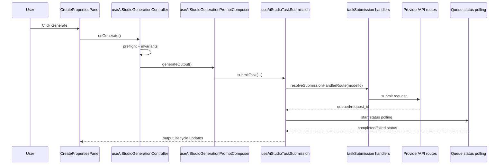

# SOP: AI Studio Create Properties And Generation Wiring

Purpose: document how the Create properties panel is wired to model selection, generation submission, and agent/control services so future work can stay behavior-safe.

## Scope
- In scope: AI Studio Create workflow wiring (`CreatePropertiesPanel`), model selectors/defaults, generate/regenerate submission pipeline, and agent + safety control service touchpoints.
- Out of scope: provider pricing policy changes, billing schema changes, and non-Create tool UI redesign.

## System map

| Layer | Source of truth | Responsibility |
| --- | --- | --- |
| Page orchestration | `frontend/pages/ai-studio.tsx` | Composes state hooks, panel contracts, model modal state, agent bridge, and generation controller handlers. |
| Create panel contract | `frontend/features/ai-studio/hooks/useAiStudioCreatePanelProps.ts` | Normalizes page-level state/handlers into `CreatePropertiesPanel` props. |
| Create panel UI | `frontend/features/ai-studio/components/CreatePropertiesPanel.tsx` + `components/create/ExpertCreatePanelView.tsx` | Renders prompt/model/aspect/resolution/character controls and routes CTA events to orchestration handlers. |
| Model option policy | `frontend/features/ai-studio/logic/modelSelectionPolicy.ts` + `hooks/useAiStudioAllowedModelOptions.ts` | Computes policy-approved options by tool/mode/video-reference mode/character mode. |
| Model metadata | `frontend/lib/model-runtime/modelCatalog.ts` + `frontend/lib/model-runtime/modelRegistry.ts` | Canonical model capabilities, payload contracts, defaults, labels, and provider routing metadata. |
| Submit orchestration | `frontend/features/ai-studio/hooks/useAiStudioGenerationController.ts` + `useAiStudioGenerationPromptComposer.ts` + `useAiStudioTaskSubmission.ts` | Applies guardrails/preflight, composes prompt/reference inputs, starts provider submit + polling lifecycle. |
| Submit handler routing | `frontend/features/ai-studio/hooks/taskSubmission/routing.ts` + `taskSubmission/{defaultHandlers,imageHandlers,videoHandlers}.ts` | Routes model ids to handler families and performs provider-specific payload submit logic. |
| Agent client bridge | `frontend/features/ai-studio/hooks/useAiStudioAgentBridge.ts` + `useAiStudioAgentOrchestration.ts` + `../../ai-agent/useAiAgent.ts` | Owns chat state, attachment prep, prompt application, and agent-output-to-generate handoff. |
| Agent runtime + control plane | `frontend/pages/api/ai/studio-agent.ts`, `frontend/pages/api/ai/{generate-prompt,describe-image}.ts`, `frontend/lib/server/api/agentSafetyPolicyControlPlane.ts`, `frontend/pages/api/admin/agent-safety-policy/*` | Server-authoritative agent execution, safety precheck/profile resolution, and admin activation/rollback/version controls. |

## Architecture diagrams

## Create properties panel wiring
1. `AiStudioPage` builds `panelProps` with `useAiStudioPanelProps`, then passes `propertiesCreate` into `AiStudioPageContent`.
2. `useAiStudioCreatePanelProps` maps shared page handlers into create-panel callbacks (`onGenerate`, `onChatOffInlineGenerate`, `onModelPickerOpen`, agent actions, character controls).
3. `CreatePropertiesPanel` chooses expert vs beginner render:
- Expert path: `expertCreateUiEligible && !beginnerMode` -> `ExpertCreatePanelView`.
- Beginner path: fallback `BeginnerCreatePanelView`.
4. Model picker open path is anchored with `anchorId="create-model"` and `context="text-image"` so modal ordering/filtering stays deterministic for Create.
5. Prompt step always routes through the same `PromptStep` contract; chat-off inline generate uses raw input fallback rules via `handleChatOffInlineGenerate`.
6. Character mode and character picker are controlled by `useCreateCharacterModeController`; selection state remains in page-level orchestration.
7. In Expert Create, the composer leading slot mounts the shared `StylesControl`; it toggles the right-rail Styles section and uses `AiStudioPageContent` shared state (`isStylesPanelOpen`, `selectedStyleId`) so Create/Edit surfaces stay in sync.

## Model selector and startup default pipeline
1. Allowed options are computed in `useAiStudioAllowedModelOptions` via `resolveAiStudioAllowedModelOptions`.
2. Policy constraints are enforced by workflow:
- Create image/text -> text-to-image capable image models.
- Edit/image -> image-to-image capable models.
- Video/kling/keyframes/motion -> mode-constrained image-to-video sets.
- Character mode in Create narrows to allowed edit-capable models.
3. `ModelModal` applies context-specific ordering (`providerPriorityByContext`, `modelPriorityByContext`) and context-specific hides (`hiddenModelIdsByContext`).
4. Selection commit path:
- `handleSelectModelFromModal` (`useAiStudioWorkspaceActions`) -> `setModel(value)` -> `closeModelModal()`.
5. Startup/default restore path:
- `useAiStudioWorkflowSettings` reads `aiStudioWorkflowSettingsByTool.v1`.
- Create startup model uses `resolveCreateWorkflowStartupModel` precedence.
- Edit startup model uses `resolveEditWorkflowStartupModel` precedence.
6. Guard effects:
- `useAiStudioStateEffects` clamps invalid aspect/resolution combinations and enforces video reference-mode/model compatibility transitions.

## Generation pipeline (Create CTA to provider polling)
1. CTA event entry:
- `CreatePropertiesPanel.onGenerate` -> `useAiStudioGenerationController.handlePrimarySubmit`.
2. Create text-mode branch:
- Chat mode ON: send to agent (`handleAgentSend`) and stage prompt from agent output.
- Chat mode OFF: resolve raw prompt via `resolveChatOffCreatePrompt`, then submit generate as Create/Image.
3. `handleGenerate` preflight:
- Acquire click lock (700ms).
- Revalidate credit coverage (`refreshBalance` path when needed).
- Evaluate start invariants (`resolveGenerationStartDecision`).
- Run character-mode preflight with 10s deadline and enforce reference invariants when character mode is active.
4. Prompt/reference composition:
- `useAiStudioGenerationPromptComposer.generateOutput` resolves tool-specific prompt + reference pool and calls `submitTask`.
5. Submission lifecycle in `useAiStudioTaskSubmission`:
- Re-check submit invariants (`submitInvariants.ts`).
- Create/reconcile optimistic placeholder output.
- Prepare reference URLs (deadline-bound preflight).
- Build and persist `generationReplay` snapshot metadata.
- Resolve handler family (`resolveSubmissionHandlerRoute`) and invoke `handleVideoModelSubmission` / `handleImageModelSubmission` / `handleDefaultModelSubmission`.
6. Provider handoff handling:
- Queued response -> `startQueuedStatusPolling`.
- Dispatched response (`request_id`) -> patch output as running, start polling, and call `ensureGenerationRecord`.
- Submit-not-started/auth-timeout invariants fail fast and mark output failed with deterministic user error text.

## Agent and control services wiring
1. Client send path:
- `useAiAgent.send` runs client pre-send safety precheck, builds request envelope, and posts `/api/ai/studio-agent`.
2. Studio-agent server path:
- `/api/ai/studio-agent` enforces auth + feature flags + envelope parsing.
- Resolves runtime safety profile through `resolveRuntimeSafetyProfile` (control-plane sync + cache).
- Runs server-authoritative input precheck before provider execution.
- Returns normalized response envelope (`message`, optional `actions`, `canonicalPrompt`, `traceId`).
3. Legacy helper routes still used by Create UX fallbacks:
- `/api/ai/generate-prompt` -> `agentRuntimeService.generatePrompt` (`legacyPromptGenerationService`).
- `/api/ai/describe-image` -> `agentRuntimeService.describeImage` (`legacyImageDescribeService`).
4. Admin control plane routes (policy operations):
- `GET /api/admin/agent-safety-policy/active`
- `POST /api/admin/agent-safety-policy/activate`
- `POST /api/admin/agent-safety-policy/rollback`
- `POST /api/admin/agent-safety-policy/version`

## Change checklist (safe edits)
When changing Create panel behavior or generation wiring, update all relevant layers in one pass:
1. Contract layer: `useAiStudioCreatePanelProps.ts` + panel component props/types.
2. Policy layer: `modelSelectionPolicy.ts` and, if model capability changed, `modelCatalog.ts`/`modelRegistry.ts`.
3. Submit layer: `useAiStudioGenerationController.ts`, `useAiStudioGenerationPromptComposer.ts`, and `useAiStudioTaskSubmission.ts` (+ route handlers if model routing changed).
4. Agent/control layer: bridge hooks and API routes if prompt ownership or safety paths changed.
5. Docs/indexes: this SOP, `sop_ai_studio_index.md`, and vertical SOPs (`text/image/video/agent`) for any behavior delta.
6. Expert Edit action wiring: keep `Remove Background` on the same regenerate pipeline using `modelIdOverride` (no parallel submit stack) and keep it free (`costOverrideCredits: 0` + Bria submit `skipBilling: true`).

## Verification checklist
- `npm -C frontend run test -- CreatePropertiesPanel useAiStudioGenerationController submitInvariants submissionPayloadMatrix`
- `npm -C frontend run docs:check`
- Manual smoke in `/ai-studio`:
  1. Create expert panel: model/aspect/resolution/character controls render and update.
  2. Chat mode ON/OFF behavior matches expected submit path.
  3. Model modal ordering is context-correct for Create.
  4. Generate submission reaches queued/dispatched states and polling converges.
  5. Agent prompt apply + generate-from-output path works and surfaces failures deterministically.
