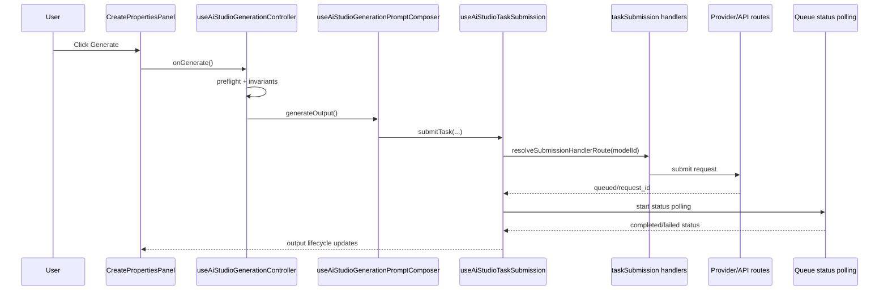

# SOP: AI Studio Create Properties And Generation Wiring

Purpose: document how the Create properties panel is wired to model selection, generation submission, and agent/control services so future work can stay behavior-safe.

## Scope
- In scope: AI Studio Create workflow wiring (`CreatePropertiesPanel`), model selectors/defaults, generate/regenerate submission pipeline, and agent + safety control service touchpoints.
- Out of scope: provider pricing policy changes, billing schema changes, and non-Create tool UI redesign.

## System map

| Layer | Source of truth | Responsibility |
| --- | --- | --- |
| Page orchestration | `frontend/pages/ai-studio.tsx` | Composes state hooks, panel contracts, model modal state, agent bridge, and generation controller handlers. |
| Create panel contract | `frontend/features/ai-studio/hooks/useAiStudioPanelProps.ts` | Assembles page-level state/handlers into `CreatePropertiesPanel` props. |
| Create panel UI | `frontend/features/ai-studio/components/CreatePropertiesPanel.tsx` + `components/create/ExpertCreatePanelView.tsx` | Renders prompt/model/aspect/resolution/character controls and routes CTA events to orchestration handlers. |
| Model option policy | `frontend/features/ai-studio/logic/modelSelectionPolicy.ts` + `hooks/useAiStudioAllowedModelOptions.ts` | Computes policy-approved options by tool/mode/video-reference mode/character mode. |
| Model metadata | `frontend/lib/model-runtime/modelCatalog.ts` + `frontend/lib/model-runtime/modelRegistry.ts` | Canonical model capabilities, payload contracts, defaults, labels, and provider routing metadata. |
| Submit orchestration | `frontend/features/ai-studio/hooks/useAiStudioGenerationController.ts` + `useAiStudioGenerationPromptComposer.ts` + `useAiStudioTaskSubmission.ts` | Applies guardrails/preflight, composes prompt/reference inputs, starts provider submit + polling lifecycle. |
| Submit handler routing | `frontend/features/ai-studio/hooks/taskSubmission/routing.ts` + `taskSubmission/{defaultHandlers,imageHandlers,videoHandlers}.ts` | Routes model ids to handler families and performs provider-specific payload submit logic. |
| Agent client bridge | `frontend/features/ai-studio/hooks/useAiStudioAgentBridge.ts` + `useAiStudioAgentOrchestration.ts` + `../../ai-agent/useAiAgent.ts` | Owns chat state, attachment prep, prompt application, and agent-output-to-generate handoff. |
| Agent runtime + control plane | `frontend/pages/api/ai/studio-agent.ts`, `frontend/pages/api/ai/extract-style.ts`, `frontend/lib/server/api/agentSafetyPolicyControlPlane.ts`, `frontend/pages/api/admin/agent-safety-policy/*` | Server-authoritative agent execution, safety precheck/profile resolution, style extraction intake, and admin activation/rollback/version controls. |

## Architecture diagrams

## Create properties panel wiring
1. `AiStudioPage` builds `panelProps` with `useAiStudioPanelProps`, then passes `propertiesCreate` into `AiStudioPageContent`.
2. `useAiStudioPanelProps` maps shared page handlers into create-panel callbacks (`onGenerate`, `onChatOffInlineGenerate`, `onModelPickerOpen`, agent actions, character controls).
3. `CreatePropertiesPanel` chooses expert vs beginner render:
- Expert path: `expertCreateUiEligible && !beginnerMode` -> `ExpertCreatePanelView`.
- Beginner path: fallback `BeginnerCreatePanelView`.
4. Model picker open path is anchored with `anchorId="create-model"` and `context="text-image"` so modal ordering/filtering stays deterministic for Create.
5. Prompt step always routes through the same `PromptStep` contract; chat-off inline generate uses raw input fallback rules via `handleChatOffInlineGenerate`.
6. Character mode and character picker are controlled by `useCreateCharacterModeController`; selection state remains in page-level orchestration.
7. In Expert Create `Standard` mode, the composer leading slot mounts the shared `StylesControl`; it toggles the right-rail Styles section and uses `AiStudioPageContent` shared state (`isStylesPanelOpen`, `selectedStyleId`) so Create/Edit surfaces stay in sync.
8. In Expert Create `Pulse` mode, `ExpertCreatePanelView` mounts `CreateExpertPresetPanel` in the left rail. That panel uses the shared per-user Pulse catalog and curated rail allocation from `user_preferences`, supports drag/drop from `CreatePulsePresetsSurface`, allows built-in Pulse presets to be edited as per-user overrides on their seeded ids, and activates a pinned preset by setting the current Pulse runtime selection instead of mutating the visible `agentInput` composer. `CreatePulsePresetsSurface` now serves both as a browse/pin surface and as a direct activation surface: clicking a Pulse there activates it immediately and pins it into the rail so the active owner remains visible. The library panel (`Libraries -> Presets -> Pulses`) remains catalog-management only and does not activate Pulses directly. Pulse definitions now carry explicit runtime metadata (`systemInstructions`, `runtimeMode`, `activationMode`, optional `starterAssistantMessage`, optional `workflowStageHints`, `outputMode`, `memoryPolicy`), but active Pulse behavior is normalized to the guided GPT-style contract: `workflow_gpt`, `activate_and_start`, and `chat_reply`. The built-in workflow starter set currently includes `Video Prompt Magic`, `Multi Sequence Video Prompt`, and `Story Builder`, and custom Pulse authoring now targets the same guided behavior. The Pulse editors also expose workflow starter templates plus a structured workflow builder (`Role & Goal`, `Step Flow`, `Final Output Shape`, `Additional Rules`) that composes stronger workflow instructions into the saved Pulse definition, plus optional `Workflow Stage Labels` that can be authored one per line for guided banner fallback. Legacy persisted `prompt_editor` / `apply_prompt` metadata may still be read for compatibility, but it is not the active product contract. Pulse mode also hard-forces Create chat mode ON, hides the inline chat-mode toggle, and suppresses the shared `StylesControl` plus right-rail Styles toggle until the user switches back to `Standard`. The current product contract remains destructive switching: changing or deactivating the active Pulse clears the prior guided session and starts fresh on the next activation.
9. Pulse runtime state is page/session-owned and now threads into `/api/ai/studio-agent` as hidden runtime metadata. The workspace snapshot persists Expert Create mode (`standard` vs `pulse`) and the currently active pinned Pulse preset id so reload/restore can return the Create shell to the same Pulse context. On project routes, that persistence is intentionally narrowed by ADR 0070: project workspace restore keeps `workspace.expertCreateMode` and `workspace.activePulsePresetId`, but it must not hydrate `pulseWorkflowSession`, transcript state, draft agent input, `promptOrigin`, or `chatModeEnabled`.
10. Active Pulse sessions render an in-chat workflow session banner showing the active Pulse name, current workflow status (`Ready to guide`, `Generating next step`, `Awaiting your reply`, `Running next step`, or completed artifact state), and the exact starter/current step copy. When the workflow text follows explicit `Step N - ...` formatting, the banner also surfaces the inferred `Step N` badge without introducing a second workflow-state source. If the workflow reply does not expose `Step N`, the banner can fall back to persisted `workflowStageHints` labels authored on the Pulse definition so guided sessions still show stage progress. The banner reads the authoritative `pulseWorkflowSession` from the active runtime/session layer rather than re-deriving workflow completion solely from the visible transcript. Project reload must not be treated as workflow-session restore; on project routes the banner should reappear only after a fresh Pulse activation regenerates that conversational runtime.

## Model selector and startup default pipeline
1. Allowed options are computed in `useAiStudioAllowedModelOptions` via `resolveAiStudioAllowedModelOptions`.
2. Policy constraints are enforced by workflow:
- Create image/text -> text-to-image capable image models.
- Edit/image -> image-to-image capable models.
- Video/kling/keyframes/motion -> mode-constrained image-to-video sets.
- Character mode in Create narrows to allowed edit-capable models.
3. `ModelModal` applies context-specific ordering (`providerPriorityByContext`, `modelPriorityByContext`) and context-specific hides (`hiddenModelIdsByContext`).
4. Selection commit path:
- `handleSelectModelFromModal` (`useAiStudioWorkspaceActions`) -> `setModel(value)` -> `closeModelModal()`.
5. Startup/default restore path:
- `useAiStudioWorkflowSettings` reads `aiStudioWorkflowSettingsByTool.v1`.
- Create startup model uses `resolveCreateWorkflowStartupModel` precedence.
- Edit startup model uses `resolveEditWorkflowStartupModel` precedence.
- Aspect ratio now follows one shared AI Studio session preference across Create, Edit, and Video surfaces instead of restoring a separate per-workflow aspect value.
6. Guard effects:
- `useAiStudioStateEffects` clamps invalid aspect/resolution combinations and enforces video reference-mode/model compatibility transitions.

## Generation pipeline (Create CTA to provider polling)
1. CTA event entry:
- `CreatePropertiesPanel.onGenerate` -> `useAiStudioGenerationController.handlePrimarySubmit`.
2. Create text-mode branch:
- Chat mode ON: send to the chat lane. When `NEXT_PUBLIC_STUDIO_AGENT_DIRECT_OPENAI_BYPASS_ENABLED=true`, the Create/Text chat surface defaults to `directOpenAiBypass=true` so `/api/ai/studio-agent` talks directly to OpenAI without a separate UI toggle.
- Chat mode OFF: resolve raw prompt via `resolveChatOffCreatePrompt`, then submit generate as Create/Image.
- Expert Create `Pulse` mode override: treat Create as chat mode ON regardless of the persisted standard-mode preference; switching back to `Standard` restores the prior Create chat-mode preference.
- Chat mode OFF cost contract: button estimate and submit/debit guardrail use the image-run cost path (`promptReferenceGenerateCostCredits`, model/aspect/image-resolution aware), not text-token cost.
3. `handleGenerate` preflight:
- Revalidate credit coverage (`refreshBalance` path when needed).
- Evaluate start invariants (`resolveGenerationStartDecision`).
- Run character-mode preflight with 10s deadline and enforce reference invariants when character mode is active.
4. Prompt/reference composition:
- `useAiStudioGenerationPromptComposer.generateOutput` resolves tool-specific prompt + reference pool and calls `submitTask`.
- For Create/Edit workflows with a selected style, the composer appends the selected style prompt to the hidden submission prompt while preserving `displayPrompt` in UI/history.
5. Submission lifecycle in `useAiStudioTaskSubmission`:
- Re-check submit invariants (`submitInvariants.ts`).
- Create/reconcile optimistic placeholder output.
- Prepare reference URLs with dynamic deadline budgeting (`base 14s + 12s per extra work unit + 14s per local blob/data input`, capped at 120s) and abortable prep stages.
- Emit preflight stage breadcrumbs (`generation_preflight_prepare_stage`) per input role/index for timeout diagnostics.
- Build and persist `generationReplay` snapshot metadata.
- Resolve handler family (`resolveSubmissionHandlerRoute`) and invoke `handleVideoModelSubmission` / `handleImageModelSubmission` / `handleDefaultModelSubmission`.
6. Provider handoff handling:
- Queued response -> `startQueuedStatusPolling`.
- Dispatched response (`request_id`) -> patch output as running, start polling, and call `ensureGenerationRecord`.
- Submit-not-started/auth-timeout invariants fail fast and mark output failed with deterministic user error text.

## Style prompt append semantics and adherence expectations
1. Style behavior contract:
- Selected style prompt is appended as plain text to the hidden submission prompt, with model-family adaptation in the composer:
  - Nano Banana family: `Visual style reference (treatment only): <style>. Preserve subject identity and base composition.`
  - Seedream family: `Visual style reference: <style>. Emphasize cohesive palette, lighting mood, and surface texture.`
  - Generic fallback and adapter-disabled mode: `Visual style reference: <style prompt>`
- Visible prompt shown to the user remains unchanged (`displayPromptOverride` path).
- Source of truth:
  - `frontend/features/ai-studio/hooks/useAiStudioGenerationPromptComposer.ts`
  - `frontend/features/ai-studio/logic/stylePromptAdapter.ts`
  - `frontend/features/ai-studio/components/AiStudioPageContent.tsx`
- Runtime kill switch:
  - `NEXT_PUBLIC_AI_STUDIO_STYLE_FAMILY_ADAPTER_ENABLED`
  - Adapter is enabled unless env is explicitly `false`.
2. Important implication:
- Style is not currently submitted as a dedicated provider control field (for example, strength/weight/style id).
- Adherence therefore depends on each model family's prompt-following behavior for appended instruction text.
3. Model-family expectations (operational guidance):
- Seedream edit/text-image families generally show stronger adherence to appended style guidance when the user prompt leaves room for style transfer.
- Nano Banana family (including Google-backed edit lanes) can prioritize edit fidelity/reference structure over appended style text, which may appear as weaker style uptake in some scenes.
- If prompt and references are highly specific/constraint-heavy, style influence naturally decreases across all families.
4. QA rubric for style adherence checks:
- Run at least three prompts per model family with the same references and style selection.
- Compare:
  - color palette transfer,
  - lighting mood transfer,
  - texture/render treatment transfer,
  - preservation of intended geometry/identity.
- Mark outcome as:
  - `strong` (3+ dimensions transferred),
  - `moderate` (2 dimensions transferred),
  - `weak` (0-1 dimensions transferred).
5. Escalation threshold:
- If a model family repeatedly scores `weak` while style append is confirmed in submission payload, treat as expected model behavior unless a regression is observed versus prior baselines.
- If the same model previously scored `strong/moderate` and drops to `weak` with unchanged setup, open a runtime regression investigation and capture payload + output evidence.

## Agent and control services wiring
1. Client send path:
- `useAiAgent.send` runs client pre-send safety precheck, builds request envelope, and posts `/api/ai/studio-agent`.
2. Studio-agent server path:
- `/api/ai/studio-agent` enforces auth + feature flags + envelope parsing.
- Resolves runtime safety profile through `resolveRuntimeSafetyProfile` (control-plane sync + cache).
- Runs server-authoritative input precheck before provider execution.
- Returns normalized response envelope (`message`, optional `actions`, `canonicalPrompt`, `traceId`).
3. Retained helper route outside the Create chat lane:
- `/api/ai/extract-style` -> `executeStyleExtraction` (`styleExtractionService`) for Styles Library new-style image intake from derived image data URLs (returns `stylePrompt` + normalized `styleTitle`).
  - Operational ownership and metadata/telemetry contracts for style-create flows are defined in `docs/sops/sop_ai_studio_style_creator.md`.
4. Direct OpenAI bypass route:
- `/api/ai/studio-agent` accepts `directOpenAiBypass=true` in the request envelope.
- The route only honors that flag when `STUDIO_AGENT_DIRECT_OPENAI_BYPASS_ENABLED=true`.
- When active, it skips studio-agent orchestration and forwards the raw chat transcript directly to OpenAI using `STUDIO_AGENT_DIRECT_OPENAI_MODEL ?? "gpt-5.4"`.
5. Create caller behavior:
- Inline chat send, prompt refine, and manual describe actions now all route through `/api/ai/studio-agent`.
- Refine/describe actions use isolated-history sends on the same canonical transport so Create no longer depends on separate prompt/describe backends.
- Pulse preset click/apply in Expert Create now activates hidden Pulse runtime behavior on `/api/ai/studio-agent` instead of writing preset text into the visible Create composer. The Pulse Presets Library and Create Pulse rail share the same persisted Pulse catalog, including per-user overrides for built-in starter Pulses, and the active Pulse flows through the agent request contract for both direct-bypass and orchestrated server paths.
- `workflow_gpt` Pulses with `activate_and_start` send a hidden activation seed immediately after click so the assistant can begin the prescribed workflow without a visible synthetic user turn.
6. Admin control plane routes (policy operations):
- `GET /api/admin/agent-safety-policy/active`
- `POST /api/admin/agent-safety-policy/activate`
- `POST /api/admin/agent-safety-policy/rollback`
- `POST /api/admin/agent-safety-policy/version`

## Change checklist (safe edits)
When changing Create panel behavior or generation wiring, update all relevant layers in one pass:
1. Contract layer: `useAiStudioPanelProps.ts` + panel component props/types.
2. Policy layer: `modelSelectionPolicy.ts` and, if model capability changed, `modelCatalog.ts`/`modelRegistry.ts`.
3. Submit layer: `useAiStudioGenerationController.ts`, `useAiStudioGenerationPromptComposer.ts`, and `useAiStudioTaskSubmission.ts` (+ route handlers if model routing changed).
4. Agent/control layer: bridge hooks and API routes if prompt ownership or safety paths changed.
5. Docs/indexes: this SOP, `sop_ai_studio_index.md`, and vertical SOPs (`text/image/video/agent`) for any behavior delta.
6. Expert Edit action wiring: keep `Remove Background` on the same regenerate pipeline using `modelIdOverride` (no parallel submit stack) and use model-priced debit (no `costOverrideCredits` bypass; Bria submit uses standard billing reservation/debit).
7. Expert Edit token workflow changes (`@img1..@img3`) must also update `docs/sops/sop_ai_studio_expert_edit_prompt_references.md`.

## Verification checklist
- `npm -C frontend run test -- CreatePropertiesPanel useAiStudioGenerationController submitInvariants submissionPayloadMatrix`
- `npm -C frontend run docs:check`
- Manual smoke in `/ai-studio`:
  1. Create expert panel: model/aspect/resolution/character controls render and update.
  2. Chat mode ON/OFF behavior matches expected submit path.
  3. In Create `mode=text` with chat OFF, Generate and inline raw-mode actions route into file generation and retain image-run cost behavior.
  4. In Create chat mode with the bypass flag enabled, agent sends bypass orchestration and hits the direct OpenAI branch inside `/api/ai/studio-agent`.
  5. Model modal ordering is context-correct for Create.
  6. Pulse mode left rail opens, `More Presets` drag/drop works, Pulse Presets Library create/edit/delete changes plus built-in Pulse overrides appear in the Create Pulse rail, clicking a pinned Pulse preset leaves the visible Create composer unchanged, and the clicked preset becomes the persisted active Pulse id used by `/api/ai/studio-agent`.
  7. A pinned `workflow_gpt` Pulse configured with `activate_and_start` begins its first assistant step immediately after click and is allowed to return message-only workflow turns until it intentionally emits a final prompt artifact.
  8. Generate submission reaches queued/dispatching/dispatched states and polling converges.
  9. Agent prompt apply + generate-from-output path works and surfaces failures deterministically.
