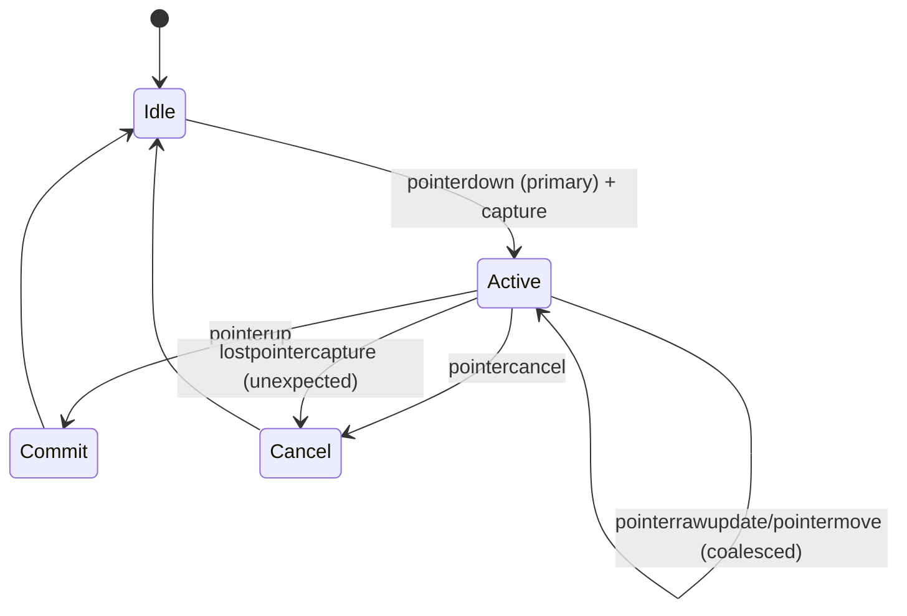

# Canonical Coordinate and Interaction Contracts for a Pixel-Accurate Drawing + Mask + Export Pipeline

## Executive summary

Your request centers on one recurring failure mode: **multiple partially-overlapping coordinate systems** (DOM geometry, CSS transforms, renderer transforms, mask buffers, export crops) drifting out of sync. The highest-leverage fix is to define and enforce a single **coordinate-space contract** with a single authoritative rectangle and a single “viewport truth,” then derive every mapping (pointer→stroke, reticle→brush, scene→mask, mask→export) from that contract with explicit forward and inverse transforms. This approach is directly supported by the platform’s geometry and transform primitives (CSSOM View DOMRects, Canvas 2D transforms/DOMMatrix, Pointer Events). citeturn4view3turn9search0turn9search4turn0search5

Several spec details matter disproportionately in real apps:

- `getBoundingClientRect()` returns an axis-aligned DOMRect **after applying CSS/SVG transforms** on the element and ancestors, and it includes padding + border. This is exactly why wrapper padding/borders routinely introduce offsets unless your “stage” origin is explicitly defined. citeturn4view2turn0search3turn7search11  
- Pointer capture is implicitly released by the user agent immediately after `pointerup`/`pointercancel`, and `pointercancel` can happen when the browser takes over panning/zooming/scrolling or decides the stream is suppressed. Your draw/drag state machine must treat `pointercancel` as a first-class termination path. citeturn2view1turn2view4turn8search13  
- For lasso fills, the **fill rule** (`nonzero` vs `evenodd`) determines self-intersection semantics; Canvas and SVG both expose these rules and define them precisely. UX choice should be explicit and test-covered. citeturn9search11turn0search10turn0search35  

The research paper you referenced is unspecified (not provided), so this report anchors to primary web standards and high-quality platform documentation, and flags any product-dependent decisions as unspecified.

## Canonical coordinate-space contract

### Define the spaces and the one-time inverse rule

Use a single canonical mapping chain:

**screen → stage → scene → mask → export**

Where each space has a strict meaning:

- **Screen space**: `(clientX, clientY)` in CSS pixels relative to the viewport origin. citeturn5search1turn5search7  
- **Stage space**: coordinates in CSS pixels relative to a single authoritative DOMRect (your “viewport truth element”). Computed via `getBoundingClientRect()`. citeturn4view3turn0search3  
- **Scene space**: your stable logical space (usually image pixel coordinates or document units).  
- **Mask space**: pixel grid used to store the inpaint mask (often same as scene/image pixels, but this is product-defined and currently unspecified).  
- **Export space**: pixel grid of the submitted artifact (full image, or cropped `imageRect`, etc.; also product-defined and currently unspecified).

**One-time inverse rule (high value):**  
Compute the full forward transform `M_scene→stage` once per “frame state” (layout + camera + fit), then invert it once to get `M_stage→scene = (M_scene→stage)⁻¹`. Every pointer sample uses that same inverse, not ad hoc “subtract/divide” logic in multiple places. In Canvas 2D, you can represent and invert transforms using `DOMMatrix` (Canvas `getTransform()` returns a `DOMMatrix`, and `DOMMatrixReadOnly.inverse()` is defined). citeturn9search4turn6search3turn6search14

### Exact formulas for the canonical mapping

Let:

- `p_screen = (x_client, y_client)` from PointerEvent/MouseEvent `clientX/Y`. citeturn5search1turn5search7  
- `R = stageEl.getBoundingClientRect()` giving `(R.left, R.top, R.width, R.height)` in CSS pixels. The rect is computed after applying transforms to the element and ancestors. citeturn4view2turn4view3turn0search3  
- `p_stage = p_screen - (R.left, R.top)`.

Now define the forward map as a composition of two affine transforms:

1) **Aspect-fit (“contain”) from scene/image to stage**  
Given scene/image size `(W_img, H_img)` and stage size `(W_stage, H_stage) = (R.width, R.height)`:

- `s_fit = min(W_stage / W_img, H_stage / H_img)`  
- `t_fit = ((W_stage - s_fit·W_img)/2, (H_stage - s_fit·H_img)/2)` (letterbox/pillarbox)  

This is the mathematical form of “contain” behavior: fit the whole image inside the box while preserving aspect ratio, leaving bars on the too-small side. citeturn7search0turn7search3turn7search9  

2) **Camera (pan/zoom) in stage units**  
Let camera state be `(z, pan)` where `z` is dimensionless zoom and `pan = (pan_x, pan_y)` is translation in stage CSS pixels. (If you store pan in scene units instead, adjust accordingly; the key is to pick one convention and document it.)

A simple camera model for “zoom about the image origin” is:

- `M_scene→stage = T(pan) · T(t_fit) · S(z·s_fit)`

A common UX requirement is “zoom about pointer” (map-style zoom): when user zooms at stage point `a_stage`, the scene point under the pointer stays fixed. That’s implemented by updating `pan` when `z` changes:

- `p_scene_anchor = M_stage→scene · a_stage`
- After updating `z_new`, choose `pan_new` so that `M_scene→stage_new · p_scene_anchor = a_stage`.

This “zoom-to-point” style is a standard pattern in interactive canvas systems. citeturn9search0turn9search4turn10search1  

**Stage → scene inversion (applied once):**  
Once you have `M_scene→stage`, compute:

- `M_stage→scene = (M_scene→stage)⁻¹`, using `DOMMatrixReadOnly.inverse()` (or your own 3×3 affine inverse). citeturn6search3turn6search14  

**Scene → mask:**  
If mask resolution equals scene/image resolution, `p_mask = p_scene` (identity). If mask resolution differs, use per-axis scaling:

- `p_mask = (p_scene.x · W_mask/W_img, p_scene.y · H_mask/H_img)`

**Mask → export (cropping):**  
If export is a crop rectangle `C` in mask pixels with origin `(cx, cy)`:

- `p_export = p_mask - (cx, cy)`  
and exported bitmap size is `(C.w, C.h)`.

This makes export alignment purely a function of consistent `p_stage→p_mask` mapping plus crop definitions.

### Contract diagram

```mermaid
flowchart LR
  A["screen (clientX/Y)"] -->|subtract stage rect| B["stage (CSS px)"]
  B -->|M_stage→scene = (M_scene→stage)⁻¹| C["scene (image px or doc units)"]
  C -->|scale (optional)| D["mask (mask px grid)"]
  D -->|crop/pack| E["export (png/jpg/webp px)"]
```

Primary-source anchors for this model are the CSSOM View geometry APIs, Canvas 2D transform APIs, and DOMMatrix inversion. citeturn4view3turn9search0turn6search3  

## CSS transforms and DOM rect measurement behavior

### What `getBoundingClientRect()` really returns under transforms

The CSSOM View spec defines `Element.getClientRects()` to return DOMRects for border boxes **with transforms applied to the element and its ancestors**, and `getBoundingClientRect()` returns the smallest rectangle enclosing those rects (i.e., an axis-aligned bounding box). citeturn4view2turn4view3

MDN also emphasizes that `getBoundingClientRect()` returns a DOMRect sized/positioned relative to the viewport, and that width/height include padding and borders (not just content). citeturn0search3turn7search11  

**Practical implication for pointer unprojection:**  
- If your stage element (or ancestors) has **only translation**, then `p_stage = client - rect.topLeft` is correct.  
- If it has **uniform scale** (e.g., `transform: scale(k)`), then `rect.width/height` are scaled, and `p_stage` is in the scaled “visual” coordinate system. If your internal stage coordinates assume unscaled CSS pixels, you must divide by `k` (and also account for `transform-origin`).  
- If it has **rotation/skew**, subtracting the axis-aligned rect origin does not give meaningful local coordinates; you must invert the full transform matrix.

### Why offset-based DOM APIs often mislead here

The CSSOM View spec explicitly notes that several layout metrics **ignore transforms** (e.g., offset widths/heights and some offset computations are defined “ignoring transforms that apply to the element and its ancestors”). This creates a classic mismatch: `offsetWidth` may reflect pre-transform geometry, while `getBoundingClientRect()` reflects post-transform geometry. citeturn3view1turn4view2  

That mismatch is responsible for many “reticle and brush drift” bugs when developers mix `offsetWidth` with `getBoundingClientRect()` or with pointer `clientX/Y`.

### If you must support transformed ancestors: use matrix inversion, not heuristics

If CSS transforms remain in your stack (sometimes unavoidable in complex layouts), the robust approach is:

1) Obtain the element’s applied transform matrix (from computed style `transform`) and incorporate `transform-origin`. The CSS Transforms spec defines how the transformation matrix is computed from `transform` and `transform-origin`. citeturn6search28turn6search1  
2) Build a `DOMMatrix` from that transform and invert it using `DOMMatrixReadOnly.inverse()` (or mutate with `invertSelf`). citeturn6search3turn6search7turn6search14  
3) Apply the inverse to your pointer point (as a homogeneous vector) to recover local coordinates.

Because the exact mapping from layout boxes to transformed coordinate spaces is product- and layout-dependent, most drawing apps choose a simpler rule: **prohibit CSS transforms (scale/rotate) on the stage and its ancestors** and keep transforms inside the renderer/camera model. That yields a simpler and more testable contract while still allowing panning/zooming via canvas transforms. citeturn4view2turn9search0  

### Visual viewport complications (mobile pinch zoom)

On mobile browsers, pinch-zoom changes the **visual viewport** without changing the layout viewport; the VisualViewport API exists specifically because `scrollX/scrollY` and layout viewport concepts can diverge while zoomed. MDN documents that on mobile, `VisualViewport.offsetLeft/offsetTop` are generally updated as the user scrolls/pinch-zooms, while `window.scrollX/scrollY` may not behave the same way as on desktop. citeturn5search0turn5search2turn5search8  

In drawing apps, the practical rule is:

- Treat pointer `clientX/Y` and `getBoundingClientRect()` as living in the same “viewport CSS pixel” coordinate system (per UI events initialization steps cited by Pointer Events), then verify mobile behavior in your regression matrix. citeturn5search7turn4view3  
- If you position overlays relative to the visible area during pinch zoom (toolbars, floating reticles), consider `window.visualViewport` offsets as an additional signal (product-specific; behavior varies by UA). citeturn5search0  

## Pointer event lifecycle correctness for draw/drag

### The minimum-safe pointer state machine

A robust drawing surface treats `pointercancel` as a normal termination path and relies on capture so it continues receiving pointers even if the pointer leaves the element.

Key normative behaviors:

- `setPointerCapture(pointerId)` designates an element as the capture target of future pointer events; capture persists until release or `pointerup`. citeturn8search5turn2view2  
- The user agent **must clear pointer capture override immediately after firing `pointerup` or `pointercancel`**, and then process pending pointer capture to fire `lostpointercapture` if needed. citeturn2view4  
- The spec requires a `pointercancel` event when the UA suppresses the pointer event stream, and it can occur for viewport manipulation or other interruptions; MDN lists common scenarios (panning/zooming/scrolling takeover, palm rejection, too many pointers). citeturn2view1turn8search13  

A practical state machine:



This is consistent with the Pointer Events capture and cancellation model. citeturn2view4turn2view1turn8search5  

### Coalesced samples and raw updates: what to do in a drawing app

Modern UAs may coalesce multiple hardware motion updates into fewer dispatched events to reduce overhead. The Pointer Events spec includes `getCoalescedEvents()` and provides canonical drawing examples that iterate coalesced samples. citeturn2view0turn10search3  
MDN states explicitly that un-coalesced events are desirable in drawing applications to build smoother curves. citeturn5search3turn8search1  

Additionally:

- `pointerrawupdate` is intended for higher-frequency updates; MDN notes it may also have coalesced events if another raw update with the same pointer id is pending in the event loop. citeturn8search4  

**Practical contract:**  
- Use `pointermove` for general interaction; optionally use `pointerrawupdate` as a high-frequency feed **only to buffer points**, not to do heavy rendering work. (The platform guidance around raw frequency exists precisely because heavy work here can jank; treat this as a performance contract rather than a correctness contract.) citeturn8search4turn8search30  

### `touch-action` is part of correctness, not just UX

Pointer Events defines how default direct manipulation behaviors (panning/zooming) are determined using `touch-action` up the ancestor chain. It explicitly notes that if CSS transforms are applied, an element’s coordinate space may differ from the screen coordinate space, affecting conformity. citeturn2view3  
MDN’s `touch-action` guidance frames the most common usage as disabling gestures on elements that provide their own dragging and zooming behavior (maps/games/surfaces). citeturn8search6turn10search3  

**Drawing surface rule:**  
Set `touch-action: none` on the stage element (or the element that receives pointer events) to prevent browser panning/zooming from stealing the pointer stream and causing `pointercancel`. Then still handle `pointercancel` because other conditions can trigger it (palm rejection, multi-pointer overload). citeturn8search6turn8search13turn2view1  

## Brush parity, lasso semantics, aspect-fit math, and export parity

### Aspect-fit + letterbox mapping math that composes with camera and mask

You described a typical inpaint constraint: export crops to `imageRect` (the on-canvas displayed image region). That makes the **contain-fit rectangle** and its composition with zoom/pan part of correctness.

Define:

- Stage size: `(W_stage, H_stage)` from the authoritative rect.
- Image/scene size: `(W_img, H_img)` in scene/mask units.
- `s_fit = min(W_stage/W_img, H_stage/H_img)`
- `imageRect_stage = { x: (W_stage - s_fit·W_img)/2, y: (H_stage - s_fit·H_img)/2, w: s_fit·W_img, h: s_fit·H_img }`

This produces letterboxing/pillarboxing consistent with “contain” semantics: image fits inside container preserving aspect ratio and leaving bars. citeturn7search0turn7search3turn7search9  

Now incorporate camera zoom/pan:

- If camera is applied around image origin, the displayed image rect in stage becomes:
  - `x' = pan_x + imageRect_stage.x`
  - `y' = pan_y + imageRect_stage.y`
  - `w' = z · imageRect_stage.w`
  - `h' = z · imageRect_stage.h`

Pointer-to-image coordinate mapping (stage → scene) becomes:

- Convert `p_stage` to image-local stage coordinates:
  - `p_imgStage = (p_stage - (pan + (imageRect_stage.x, imageRect_stage.y))) / z`
- Convert from stage pixels to scene pixels:
  - `p_scene = p_imgStage / s_fit`

If your mask space equals image pixels: `p_mask = p_scene`.

**Export crop parity:**  
If you export only the image area (not letterbox bars), you must crop in mask/image pixels, not stage pixels. That means you should export the mask buffer directly (or render it to an export canvas) using the same image-space basis, rather than exporting a screenshot of the stage. The platform’s canvas export APIs (`toBlob()`, `toDataURL()`) operate on the canvas bitmap you choose to export. citeturn9search2turn9search6  

### Brush size parity math across CSS px, DPR, zoom, and mask scaling

You want: **reticle diameter == painted diameter** at zoom `{0.5, 1, 2, 4}`.

To make this provable, you must declare a *single source of truth* for brush size. Two viable contracts exist; pick one and test it:

#### Contract A: brush specified in mask pixels (recommended for inpainting)

Let slider value be `D_mask` (diameter in mask pixels). Then, at any zoom, painting uses `D_mask` directly in mask space.

Displayed reticle diameter in stage CSS pixels:

- `D_stageCss = D_mask · s_fit · z`

This makes the reticle grow/shrink on screen with zoom, but the painted area in the mask remains stable in image units.

#### Contract B: brush specified in screen CSS pixels (map/annotation style)

Let slider value be `D_stageCss`. Then the mask-space diameter must compensate for zoom:

- `D_mask = D_stageCss / (s_fit · z)`

This keeps brush visually constant size regardless of zoom, but mask-space footprint changes with zoom (often undesirable for inpainting).

Both are correct in different products; which one you want is currently unspecified. The key is that you cannot mix these contracts without drift.

#### Where DPR enters (and where it should not)

`window.devicePixelRatio` is defined as the ratio of physical device pixels to CSS pixels. citeturn11search0turn11search3  
DPR affects **rendering sharpness**, not your logical mapping, if you structure it correctly.

A clean parity strategy:
- Keep *stage/scene/mask math in CSS pixels + image pixels only* (no DPR).
- Render overlays (reticle) on a high-DPI canvas by sizing its bitmap to `cssSize * dpr` and scaling the context accordingly, so that 1 CSS px remains 1 logical unit in your draw calls.  
- Do the same for the display canvas, while preserving the mask buffer in logical pixels.

This matches the platform behavior that changing canvas `width`/`height` resets state and that transforms are explicit; you re-apply DPR scaling via `setTransform()` after resize. citeturn9search1turn9search0turn11search2  

#### Zoom parity table (symbolic)

Assume Contract A (mask-pixel brush). Let `k = s_fit`:

| zoom `z` | reticle in CSS px `D_stageCss` | painted in mask px |
|---|---|---|
| 0.5 | `D_mask · k · 0.5` | `D_mask` |
| 1 | `D_mask · k · 1` | `D_mask` |
| 2 | `D_mask · k · 2` | `D_mask` |
| 4 | `D_mask · k · 4` | `D_mask` |

If your tests show mismatch, the bug is almost always one of:
- `k` computed from a different rect than the pointer mapping uses,  
- zoom applied twice (CSS transform + camera),  
- padding/border offsets, or  
- mixing scene units and stage units in pan. citeturn4view3turn0search3turn3view1  

### Lasso fill semantics: `nonzero` vs `evenodd` and self-intersections

Both Canvas and SVG expose the same conceptual fill rules:

- **`nonzero`** (winding rule): “inside” determined by winding count; depends on path direction. citeturn0search35turn0search10turn9search15  
- **`evenodd`**: “inside” determined by parity of crossings; does not depend on winding direction. citeturn0search10turn0search35  

Canvas specifics:
- `CanvasRenderingContext2D.fill()` accepts an optional `fillRule` parameter and MDN demonstrates that `evenodd` leaves holes where `nonzero` would fill. citeturn9search11  
- Same applies to `clip()` with `fillRule`. citeturn0search6  

**UX recommendation (explicitly a product choice):**
- For a freehand lasso where users may self-intersect accidentally, `evenodd` usually matches user intuition that crossings “toggle” inside/outside because it’s direction-independent.  
- For vector-authoring workflows where path direction is meaningful and holes are constructed intentionally, `nonzero` can be preferable.

Because this is a product decision, lock the rule in your tool contract, and add regression tests for at least:
- simple loop,
- figure-eight self-intersection,
- nested loops (hole),
- retracing over an edge.

### Export/flatten camera parity: draw-time vs submit-time

Canvas export APIs export the bitmap of the canvas you choose; they do not “know” about your camera model. citeturn9search2turn9search6  
Therefore parity is entirely on you:

**If you draw into a mask buffer in mask/image space (recommended):**  
- draw-time camera affects only the *display*, not the *mask*.  
- submit-time export should serialize the mask buffer (possibly cropped), ensuring perfect parity regardless of current zoom/pan UI.

**If you draw directly into a display canvas with camera transforms:**  
- submit-time export must re-render into an export canvas using the same mapping from scene to export (not scene to stage), or you will export letterbox bars, UI overlays, or the wrong crop.

Also remember that changing canvas `width/height` resets the context state and clears the backing buffer: resizes during export or “flatten” steps must reapply transforms and redraw deterministically. citeturn9search1turn9search5  

## Single source of viewport truth and transform ownership contracts

### Define the authoritative DOM rect and why wrapper padding causes offsets

You asked to “prove why” wrapper padding is a likely offset contributor. The proof is in the platform definitions:

- `getBoundingClientRect()` returns the smallest rectangle containing the element, and includes padding and border. citeturn0search3turn7search11  
- CSS’s box model defines content/padding/border as distinct regions; padding and border exist outside the content box. citeturn7search11  

So if your **logical stage origin** is the *content box* top-left, but your pointer→stage computation uses `rect.left/top` (border edge), you introduce a systematic offset approximately equal to border+padding unless you correct for it.

**Recommended contract (single viewport truth):**
- Pick the element that *defines stage coordinates* and ensure it has **no padding/border** (or treat stage origin as its padding edge explicitly).
- Use that element for:
  - pointer sampling (`rect = stageEl.getBoundingClientRect()`),
  - stage sizing (for fit math),
  - overlay sizing,
  - camera constraints.

If you must use a padded wrapper as the authoritative rect, define stage coordinates relative to the wrapper’s padding edge and subtract border widths (and optionally padding) derived from computed styles. (Details are implementation-specific; the key is the contract, not the specific code.)

### Inline vs modal transform ownership: one rule to prevent divergence

This is the “do not let two surfaces disagree again” rule.

**Transform ownership contract (high value):**
- Either:
  - **DOM owns transforms** (CSS transform scaling/rotation), and your renderer is identity in stage space; pointer unprojection must invert DOM matrices; or  
  - **Renderer owns transforms** (camera inside canvas/WebGL), and the DOM stage and ancestors are not scaled/rotated (layout-only).

Mixing these (e.g., CSS scale on wrapper + internal camera zoom) forces you to compose and invert transforms across two systems, and the failure modes (reticle drift, export mismatch, hit-test mismatch) are exactly what you’re trying to eliminate. The CSSOM View spec and Pointer Events spec both explicitly surface how transforms affect coordinate spaces and DOM geometry. citeturn4view2turn2view3  

### A React + TypeScript enforcement pattern

Use a single “ViewportContext” providing:
- `stageRect` (authoritative DOMRect),
- `M_sceneToStage` and `M_stageToScene`,
- `imageRectStage` (contain-fit rect),
- `dpr` (for rendering only).

Update `stageRect` via `ResizeObserver` and re-sample `getBoundingClientRect()` on resize; `ResizeObserver` exists specifically to observe element size changes. citeturn11search1turn11search21  

## Numeric acceptance thresholds and regression harness plan

### Hard tolerances (set now, test forever)

Because browsers and GPUs can introduce tiny floating-point and rasterization differences, thresholds must be defined in both CSS px and mask px.

The following defaults are conservative and map to known quantization bounds (rounding to nearest pixel implies ≤ 0.5 px error). They are recommendations; adjust based on your product’s tolerance for jitter.

| Metric | Suggested threshold in CSS px | Suggested threshold in mask px | Notes |
|---|---:|---:|---|
| Pointer-to-stroke center error | ≤ 0.75 CSS px | ≤ 0.5 mask px | 0.5 px is the theoretical bound if you round to pixel centers; 0.75 allows some float drift. |
| Reticle diameter vs painted diameter | ≤ 1.0 CSS px | ≤ 0.5 mask px | Diameter errors are visually salient; require tight mask parity. |
| Export alignment vs mask buffer | ≤ 1.0 CSS px equivalent | ≤ 1.0 mask px | Export/crop edges should snap; allow 1 px worst-case for lossy pipelines. |
| Lasso fill area parity | N/A | exact match (0 px) | Fill rule is deterministic; diff implies math/transform bug. |

Where this ties back to platform primitives:
- Pointer sampling happens in CSS pixels (`clientX/Y`, Playwright mouse actions operate in main-frame CSS pixels). citeturn5search1turn10search1  
- Rendering parity across DPR requires explicit DPR scaling but should not change logical coordinates. DPR definition is explicit. citeturn11search0turn11search3  

### Regression harness plan: matrix and method

#### Test matrix (minimum set)

You requested coverage across zoom, pan, aspect changes, DPR, and tool modes. A focused minimum:

- Zoom: `{0.5, 1, 2, 4}`
- Pan: `{(0,0), (37, -19), (-120, 80)}` (non-zero, non-multiple-of-2 values catch rounding bugs)
- Stage aspect: `{1:1, 4:3, 16:9}` with multiple sizes (e.g., 512×512, 1000×750, 1200×675)
- Image aspect: `{1:1, 4:3, 16:9, 9:16}`
- DPR / device scale factor: `{1, 2, 3}` (use Playwright’s `deviceScaleFactor`, “can be thought of as dpr”). citeturn12search1turn11search0  
- Modes: `{brush, eraser, lasso-evenodd, lasso-nonzero}`
- Export: `{full image export, crop-to-imageRect export}` (product-defined; currently unspecified details)

#### Harness building blocks

1) **Pure math unit tests (fast, deterministic)**  
Test:
- `containFitRect()` returns expected scale and offsets.
- `M_scene→stage · M_stage→scene ≈ I` within tolerance.
- For selected points, `stage→scene→stage` round-trip error ≤ threshold.

These tests should not depend on canvas or browser rendering.

2) **Integration tests with real browser events**  
Use Playwright to:
- set `deviceScaleFactor` and viewport,  
- drive pointer paths via `page.mouse` (documented as CSS-pixel-relative to viewport), citeturn10search1turn12search1  
- compare exported artifacts using screenshot comparisons (`toHaveScreenshot`) and/or compare exported blobs (PNG) pixel-by-pixel.

Playwright’s screenshot snapshot testing is first-class (`expect(page).toHaveScreenshot()`). citeturn10search0turn10search4  

3) **Visual regression for “drift signatures”**  
Keep golden images for:
- reticle centered on painted dot at each zoom,
- lasso self-intersection cases,
- export crop boundaries aligned to a checkerboard pattern.

This catches the “it looks slightly off only at zoom 0.5 on DPR 3” class of bugs that are hard to reason about verbally.

4) **Pointer cancellation and capture tests**  
Programmatically trigger scenarios:
- begin stroke, then simulate page scroll/gesture if possible (or force `pointercancel` by changing `touch-action` environment in a test page),
- verify internal state resets and no “stuck drawing” occurs.

`pointercancel` and implicit release of capture are specified behaviors; your code should treat them as expected, not exceptional. citeturn2view1turn2view4turn8search13  

### What must be specified to fully lock this down

To make the contracts and thresholds fully “mechanically provable,” these product details remain unspecified and should be decided explicitly:

- Is brush size defined in **mask pixels** or **screen pixels**?  
- Is mask resolution equal to source image resolution, or a separate standardized resolution?  
- What exact rectangle is exported: full image, crop to contain-fit imageRect, or a user-defined crop?  
- Are CSS transforms allowed anywhere in the stage ancestry, or prohibited by policy?

Once those are specified, the mapping chain above becomes a complete spec for your implementation and test harness, and every reported drift can be localized to one of a small number of transformation boundaries backed by the platform’s defined geometry and event semantics. citeturn4view2turn2view3turn9search0turn0search5