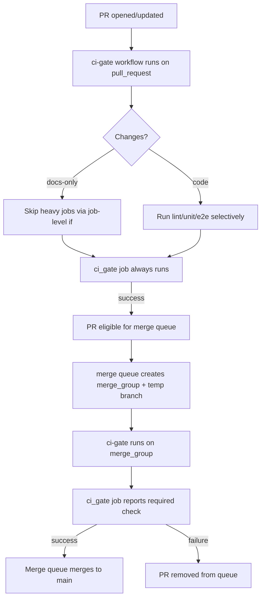

# High-Concurrency AI Development on a Single Git Work Tree in VS Code

## Executive summary

Running many AI agents (multiple chat sessions, multiple local/remote agent instances) against the same repository is best treated as a **high-concurrency distributed system** problem: you need isolation boundaries (files, branches, environments), deterministic gates (required checks), and auditable controls (secrets, signing, permissions). The safest “default” operating model is:

- **One agent ⇢ one isolated working directory (git worktree) ⇢ one short-lived branch ⇢ one PR**; merge via a protected trunk branch with required checks. Git supports multiple worktrees on a single repository so multiple branches can be checked out at once. citeturn19search1
- Use **rulesets / branch protections** to force work to go through PRs and required checks, rather than letting agents push directly to trunk. In GitHub-hosted private repos, protected branches (and required status checks) require paid tiers (Pro/Team/Enterprise). citeturn1view1turn1view2
- If you want **merge queue on private repos**, today’s constraint matters: it’s available for private repositories owned by organizations using **GitHub Enterprise Cloud** (public org repos can also use merge queue). citeturn2view2
- For **conditional CI** (path-based selective tests), you must design around GitHub’s exact semantics:  
  - If a **workflow** is skipped due to path filtering, required checks may remain **Pending** and block merges. citeturn10search31  
  - If a **job** inside a running workflow is skipped via an `if:` conditional, it reports as **Success** and does *not* block merges. citeturn4search3turn10search31  
  This pushes you toward an always-running “gate” check that decides what to run, but still emits a required check result on every PR and merge queue run.

A pragmatic “impact vs effort” prioritization (for a team like ShortPulse, assuming many concurrent agents and a Next.js repo):

- **Highest impact, moderate effort:** Required-check + merge queue semantics and the “always-report a required check” CI design (prevents broken merges and reduces wasted CI). citeturn2view2turn10search31turn4search3  
- **Highest risk reduction, moderate effort:** Secrets defense-in-depth: push protection + local pre-commit/pre-push scanning + least-privilege preview environments (prevents catastrophic credential leaks from AI-authored commits). citeturn9search9turn9search6turn9search3turn12search6  
- **High leverage, low-to-moderate effort:** One-command worktree bootstrap + TTL cleanup automation (keeps branch/worktree sprawl manageable under many agents). citeturn7search0turn7search1turn19search1

## Assumptions and context

These items were not specified; the guidance below assumes:

- Repos are hosted on GitHub.com and at least some are **private**, and you want enforceable PR governance (protected branches/rulesets). citeturn1view1turn2view0
- CI is primarily **GitHub Actions** (because merge queue requires `merge_group` triggers in Actions if Actions is the CI provider). citeturn2view2turn4search0
- The repo includes one or more **Next.js** apps, and local development involves running multiple dev servers in parallel. Next.js explicitly documents how dev output directories and ports work. citeturn16view1turn16view2
- Your agents may be:
  - local tooling that can run shell commands and edit files,
  - IDE-integrated agents inside VS Code, and/or
  - cloud agents that open PRs.
- The “research paper” you referenced was not provided, so this report treats your list as the authoritative research agenda and relies on official/vendor documentation plus community evidence.

## GitHub plan capability matrix for rulesets, required checks, and merge queue

### What is enforceable where (as-of March 20, 2026)

GitHub’s own “Who can use this feature?” sections are the most reliable place to ground plan gating.

- **Protected branches / required status checks**  
  Protected branches are available:
  - in **public** repos on GitHub Free, and
  - in **public + private** repos on GitHub Pro/Team/Enterprise Cloud/Enterprise Server. citeturn1view1turn1view2

- **Rulesets (branch/tag rulesets)**  
  Rulesets are available:
  - in **public** repos on GitHub Free, and
  - in **public + private** repos on GitHub Pro/Team/Enterprise Cloud. citeturn2view0turn17search12  
  Rulesets are also explicitly documented as a governance mechanism that can apply across repositories for Team/Enterprise plans (organization-level rulesets). citeturn17search1turn17search11

- **Merge queue**  
  Merge queues are available:
  - in **public** repositories owned by an organization, and
  - in **private** repositories owned by organizations using **GitHub Enterprise Cloud**. citeturn2view2

### Capability matrix (private repositories)

| Plan / SKU (GitHub.com) | Enforceable rulesets in private repos | Required checks on protected branches in private repos | Merge queue in private repos | Notes |
|---|---:|---:|---:|---|
| Free (user/org) | No (public only) citeturn17search12 | No (public only) citeturn1view1 | No (private MQ requires Enterprise Cloud) citeturn2view2 | Without protections, multi-agent concurrency tends to devolve into direct pushes + frequent breakage. |
| Pro (personal) | Yes citeturn17search12 | Yes citeturn1view1 | No citeturn2view2 | Good for individuals; doesn’t unlock private merge queue. |
| Team (org) | Yes citeturn17search12 | Yes citeturn1view1 | No (private MQ still Enterprise Cloud per docs) citeturn2view2 | Team now supports organization-level rulesets (scale governance) citeturn17search11 and includes push rulesets. citeturn17search12 |
| Enterprise Cloud (org) | Yes citeturn17search12 | Yes citeturn1view1 | Yes citeturn2view2 | Only documented way to get private merge queue on GitHub.com. citeturn2view2 |
| Enterprise Server (self-hosted) | Rulesets exist on modern GHES versions (feature availability depends on your GHES version and configuration) citeturn11search0turn11search11 | Yes (protected branches are supported) citeturn1view1 | Merge queue is a GitHub.com feature; do not assume parity without verifying your GHES version’s features | Treat GHES as “versioned product,” not “plan.” |

### Push rulesets (bonus governance lever for high agent concurrency)

Push rulesets are a materially different lever than branch/tag rulesets, because they can block pushes based on file properties and apply across a repository’s fork network. GitHub’s docs state push rulesets are available for the GitHub Team plan in internal/private repos and forks of repos with push rulesets. citeturn17search12

This is relevant for AI concurrency because you can block entire classes of risky pushes (for example, `.env*`, private keys, generated artifacts, extremely large files) before they ever land. citeturn17search12turn17search5

## Merge queue, conditional CI, and skipped-check semantics

### Merge queue’s core constraint: required checks must be reported on merge groups

A merge queue will wait for required checks; if checks are not reported for merge group events, the merge fails. GitHub explicitly requires that **GitHub Actions workflows include `merge_group`** (in addition to `pull_request`) to run and report required checks for PRs in the queue. citeturn2view2turn4search0

GitHub’s docs also describe that merge queue creates temporary branches (often with a special prefix) to validate the merge group; third‑party CI must be configured to run on those branches. citeturn2view2turn4search5

### The non-obvious part: “paths filters” can silently break required checks

GitHub explicitly warns:

- If a **workflow** is skipped due to path filtering (or branch filtering / commit message rules), the check can remain **Pending**, and a PR that requires it will be blocked. citeturn10search31
- If a **job inside a workflow** is skipped due to an `if:` conditional, the job reports **Success** and does not prevent merging—even if it’s a required check. citeturn4search3turn10search31

This leads to a critical design choice:

- Avoid `on: pull_request: paths:` (or `paths-ignore:`) for workflows whose checks you mark “required.” citeturn10search31
- Prefer an **always-triggering workflow** that computes change scope internally and then selectively runs jobs (or selectively runs expensive steps) while always emitting a single, required “CI Gate” check result.

### Recommended CI pattern: a single required “CI Gate” job that is always reported

This pattern addresses:
- merge queue (`merge_group`) requirements, citeturn2view2turn4search0
- required checks + path filtering semantics, citeturn10search31
- and the “skipped job reports success” footgun if you naïvely require the wrong check name. citeturn4search3turn3search1

**Key idea:** Only mark **one** check as required (the gate). Everything else can be conditional, but the gate job always runs and fails if anything critical failed.

```yaml
# .github/workflows/ci-gate.yml
name: ci-gate

on:
  pull_request:
  merge_group:

jobs:
  plan:
    runs-on: ubuntu-latest
    outputs:
      web_changed: ${{ steps.diff.outputs.web_changed }}
      docs_only: ${{ steps.diff.outputs.docs_only }}
    steps:
      - uses: actions/checkout@v4
        with:
          fetch-depth: 0
      - id: diff
        shell: bash
        run: |
          set -euo pipefail
          BASE_SHA="${{ github.event.pull_request.base.sha || github.event.merge_group.base_sha }}"
          HEAD_SHA="${{ github.sha }}"
          CHANGED="$(git diff --name-only "$BASE_SHA" "$HEAD_SHA")"

          echo "$CHANGED" | grep -qE '^apps/web/' && echo "web_changed=true" >> "$GITHUB_OUTPUT" || echo "web_changed=false" >> "$GITHUB_OUTPUT"
          echo "$CHANGED" | grep -vqE '^(docs/|README\.md$)' && echo "docs_only=false" >> "$GITHUB_OUTPUT" || echo "docs_only=true" >> "$GITHUB_OUTPUT"

  lint:
    needs: plan
    if: ${{ needs.plan.outputs.docs_only != 'true' }}
    runs-on: ubuntu-latest
    steps:
      - uses: actions/checkout@v4
      - run: npm ci
      - run: npm run lint

  tests_web:
    needs: plan
    if: ${{ needs.plan.outputs.web_changed == 'true' }}
    runs-on: ubuntu-latest
    steps:
      - uses: actions/checkout@v4
      - run: npm ci
      - run: npm test --workspace apps/web

  ci_gate:
    # This is the ONLY required status check you select in branch protection / rulesets.
    needs: [plan, lint, tests_web]
    if: ${{ always() }}
    runs-on: ubuntu-latest
    steps:
      - name: Evaluate upstream results
        shell: bash
        run: |
          set -euo pipefail
          # Fail if any needed job failed or was cancelled.
          # (Jobs skipped due to IF conditions are typically treated as success; do not trust that to “mean safe”.)
          RESULTS="${{ toJson(needs) }}"
          echo "$RESULTS" | grep -q '"result":"failure"' && exit 1 || true
          echo "$RESULTS" | grep -q '"result":"cancelled"' && exit 1 || true
          echo "CI gate passed."
```

Why this works:

- The workflow always triggers on `pull_request` and `merge_group`, so the required check is always reported (no “Pending forever” due to workflow-level path skipping). citeturn10search31turn2view2turn4search0
- Heavy jobs are conditional via `if:` (safe because job-level skipping reports success and doesn’t deadlock required checks). citeturn4search3turn10search31
- The gate forces a deterministic pass/fail decision that merge queue can honor. citeturn2view2

### Mermaid flowchart: merge queue + gating logic



This aligns with GitHub’s requirement that merge queue relies on required checks and `merge_group` triggers. citeturn2view2turn4search0

### CI cost containment without weakening required-check guarantees

The pattern above is the foundation; then add cost controls that don’t change correctness:

- **Concurrency cancellation**: cancel stale PR runs when new commits arrive (keeps queue time down with many agent pushes). GitHub Actions’ `concurrency` cancels in-progress runs/jobs in the same group when a new run starts. citeturn10search0
- **Dependency caching**: cache package installs/build artifacts to reduce minutes and latency. GitHub documents dependency caching behavior and scope. citeturn10search1
- **Selective tests** inside an always-on workflow (don’t use workflow-level `paths` on required checks). citeturn10search31

## Worktree operating model for Next.js repos in VS Code

### Why worktrees are the right isolation primitive for many concurrent agents

A git repository can support **multiple working trees**, enabling multiple branches to be checked out simultaneously. That’s exactly what you want when multiple agents are changing code concurrently without stepping on each other’s uncommitted state. citeturn19search1

VS Code has first-class guidance for using branches and worktrees for parallel development. citeturn5search7

### Next.js-specific best practices under worktrees

**Cache and build output isolation**

- Next.js supports configuring a custom build directory via `distDir` (instead of `.next`). This matters if you need explicit separation between outputs across different local workflows. citeturn16view2
- Next.js documents that development builds output to `.next/dev` instead of `.next`, enabling `next dev` and `next build` concurrently without conflicts inside a single working directory. citeturn16view1
- If you’re using Turbopack filesystem caching, Next.js states it saves and restores cached data to the `.next` folder between builds/dev sessions (faster, but each worktree accumulates its own cache). citeturn16view0

**Dev server lock avoidance**

The two most common “self-inflicted” collisions when many worktrees are active:

- **Port conflicts**: Next.js documents changing ports via `-p/--port` or `PORT=...`. citeturn16view1  
- **Shared directory conflicts**: worktrees avoid shared `.next` state by default because each worktree is a separate directory; additionally, Next.js explicitly segregates dev output to `.next/dev`. citeturn16view1turn19search1

### VS Code multi-window vs multi-root when you have many worktrees

- **Separate VS Code windows per worktree** is the safest mental model (each window has one branch checked out, fewer accidental edits on the wrong branch). VS Code’s worktrees guidance is oriented around parallel development. citeturn5search7
- **Multi-root workspaces** are useful when you truly need multiple folders visible at once (for example, comparing two worktrees side-by-side), but they increase the risk of “edit in the wrong tree.” VS Code documents how multi-root workspaces behave. citeturn5search3

### Step-by-step: per-agent worktree workflow (manual)

Assume your main repo is already cloned at `~/repo/main`.

```bash
# 1) From your main working tree, make sure trunk is current
cd ~/repo/main
git fetch origin
git switch main
git pull --ff-only

# 2) Create a per-agent branch and worktree
AGENT="alice"
ISSUE="1234"
BR="agent/${AGENT}/${ISSUE}-navbar-fix"
WT="../wt-${AGENT}-${ISSUE}"

git worktree add -b "$BR" "$WT" origin/main

# 3) Open a fresh VS Code window for that worktree
code -n "$WT"

# 4) In the worktree, run Next.js on a unique port
cd "$WT"
PORT=3011 npm run dev
```

This uses git worktrees exactly as documented: multiple working trees attached to the same repo. citeturn19search1  
The port selection follows Next.js’ documented `PORT` / `-p` semantics. citeturn16view1

### One-command worktree bootstrap and teardown automation

A minimal “agent worktree manager” script (POSIX-ish shell):

```bash
#!/usr/bin/env bash
# scripts/agent-wt
set -euo pipefail

cmd="${1:-}"
agent="${2:-}"
ticket="${3:-}"
slug="${4:-change}"
base="${5:-origin/main}"

if [[ -z "$cmd" || -z "$agent" || -z "$ticket" ]]; then
  echo "Usage:"
  echo "  scripts/agent-wt up <agent> <ticket> [slug] [base]"
  echo "  scripts/agent-wt down <agent> <ticket>"
  exit 2
fi

repo_root="$(git rev-parse --show-toplevel)"
branch="agent/${agent}/${ticket}-${slug}"
wt="${repo_root%/}/../wt-${agent}-${ticket}"

case "$cmd" in
  up)
    git -C "$repo_root" fetch origin
    git -C "$repo_root" worktree add -b "$branch" "$wt" "$base"
    echo "Worktree created: $wt"
    echo "Branch: $branch"
    echo "Next.js suggestion: PORT=$((3000 + RANDOM % 500)) npm run dev"
    ;;
  down)
    # remove worktree + prune metadata
    git -C "$repo_root" worktree remove --force "$wt"
    git -C "$repo_root" worktree prune
    echo "Worktree removed: $wt"
    echo "NOTE: remote branch deletion is separate; rely on PR merge + auto-delete."
    ;;
  *)
    echo "Unknown cmd: $cmd"
    exit 2
    ;;
esac
```

The underlying primitives (`git worktree add/remove/prune`) are standard Git functionality. citeturn19search1

## Agent permission hardening: Codex vs Claude vs Gemini vs VS Code controls

### Comparative threat model: what you must assume with many agents

Under high agent concurrency, assume the following “routine” failures happen unless you harden:

- An agent tries to run a dangerous command, fetch remote content, or exfiltrate data via network.
- An agent accidentally stages or commits secrets.
- An agent makes broad config edits (CI, auth, IAM) that look “small” but have huge impact.
- Permission prompts get bypassed for convenience.

The goal is “safe by default” *without* making the workflow unusable.

### What each system documents about safety controls

**Codex (OpenAI)**  
Codex documents a two-layer model: sandbox boundaries + approval policy. It explicitly states network access is off by default and describes OS-enforced sandboxing locally. It also documents protected paths like `.git` and `.codex` as read-only even inside writable roots. citeturn18view0turn18view1turn18view2  
For cloud environments, Codex documents a two-phase runtime model (setup may use network; agent phase runs offline by default) and that secrets configured for cloud environments are available only during setup and removed before the agent phase starts. citeturn18view0

**Claude Code (Anthropic)**  
Claude Code documents a permissions system with Allow/Ask/Deny rules for tools, managed via `/permissions`. citeturn6search1  
Claude Code’s security docs describe default protections including permission gating and default blocking of certain risky commands like `curl`/`wget` unless explicitly allowed. citeturn6search9  
Claude Code also documents sandboxing as an OS-level limit on damage and network access outside the sandbox triggers a block + user choice. citeturn6search37

**Gemini (Google)**  
Gemini Code Assist agent mode documentation describes a plan-first workflow where you review/approve a plan before changes, and permissions can be requested as execution proceeds. citeturn6search10  
Gemini CLI plan mode (announced March 2026) is explicitly described as **read-only**, restricting tools to safe exploration and planning by default. citeturn6search2turn6search6  
Google’s documentation also describes that agent mode can be configured to auto-approve changes (which is a risk knob you must govern). citeturn6search30turn6search14

**VS Code agent controls**  
VS Code documents agent permission levels, including “Bypass Approvals” / “Autopilot” modes that auto-approve tools for a session. citeturn6search15  
VS Code security guidance explicitly warns that some third-party agents offer settings that bypass permission checks (example: `allowDangerouslySkipPermissions`), and recommends enabling such settings only in sandboxed/containerized environments. citeturn6search7turn6search27

### Recommended “safe default” policy stack

Think in layers; each layer should still work if the one above fails:

- **Layer 1: Repository governance gates**
  - Require PRs to merge; block direct pushes to trunk via rulesets/protected branches. citeturn2view1turn1view1
  - Use CODEOWNERS + required reviewer / required review from code owners for sensitive paths (CI, infra, auth). CODEOWNERS behavior is defined in GitHub’s docs. citeturn14search2turn14search21

- **Layer 2: Agent runtime sandbox**
  - Default to no network (unless explicitly needed) and workspace-only writes (Codex documents this as the default posture). citeturn18view0turn18view1
  - For Windows, prefer WSL-based dev for fewer file locking/symlink issues and consistent sandbox semantics; Codex explicitly recommends WSL workflows in its Windows guidance. citeturn18view3

- **Layer 3: Explicit approvals for high-risk operations**
  - Disallow or require “Ask” for: `git push`, writing under `.github/workflows/`, editing secrets/config files, running package installs, running “network tools.” (Claude’s model is directly Allow/Ask/Deny.) citeturn6search1turn6search9
  - Ensure VS Code isn’t set to bypass approvals for sessions with repo secrets accessible. citeturn6search15turn6search7

- **Layer 4: Audit + provenance**
  - Require signed commits on trunk and/or require signed commits via protections (GitHub documents “Require signed commits” on protected branches). citeturn8search3turn8search0
  - Use PR templates to capture agent identity and risk tags. GitHub documents PR templates. citeturn14search1turn14search0

## Branch naming, lifecycle governance, and conflict reduction under high agent concurrency

### Comparison table: concurrency approaches (pros/cons)

| Approach | Pros | Cons | When it wins |
|---|---|---|---|
| Single shared branch | Lowest process overhead | Highest collision rate; agents overwrite each other; little auditability; frequent breakage | Only for solo experiments or throwaway spikes |
| Per-agent branches | Strong isolation; clear ownership; parallelism scales with agents | Branch sprawl without TTL + auto-delete; more PRs | Default for “many agents, many small tasks” |
| Per-feature branches | Aligns with feature-level ownership; fewer branches than per-agent | Multiple agents on same feature branch can still collide; needs coordination | When humans coordinate multiple agents on one feature |
| Ephemeral worktrees (per-agent) | Best local isolation; fast context-switching; avoids “stash wars”; multiple branches checked out at once in separate dirs | Extra disk usage; more running dev servers; requires automation and cleanup | High-concurrency local development; “agent swarm” workflows citeturn19search1turn5search7 |
| Monorepo considerations | Can reduce duplication of shared libs; unified CI and tooling | Path-based required checks are tricky; selective testing must be implemented carefully to avoid “pending required checks” deadlocks citeturn10search31 | When you need shared libraries + consistent governance |

### Branch naming + lifecycle governance patterns that prevent sprawl

The simplest workable governance set:

- **Branch prefix for agents:** `agent/<agent-id>/<ticket>-<slug>`
- **Always PR, never push to trunk:** enforce via rulesets/protected branches. citeturn2view1turn1view1
- **Auto-delete merged branches:** enable “Automatically delete head branches.” citeturn7search0

When you need explicit TTL policies beyond “delete after merge,” you can automate branch cleanup using the Git references REST API (branches are just refs; you delete a ref). citeturn7search1

### Stale worktree / branch cleanup automation (scheduled)

A typical policy that works under load:

- Delete remote `agent/*` branches if:
  - no open PR, and
  - last commit older than N days (TTL), OR
  - PR merged and auto-delete didn’t apply (edge cases)

GitHub’s API supports deleting refs via `DELETE /repos/{owner}/{repo}/git/refs/{ref}`. citeturn7search1

### Conflict reduction automation: rerere + rebase cadence + small-PR policy

**rerere (reuse recorded resolution)**  
Git documents `git rerere` as recording conflict resolutions and reapplying them when the same conflict reoccurs; it requires enabling `rerere.enabled`. citeturn19search0turn19search3

Minimal setup:

```bash
git config --global rerere.enabled true
git config --global rerere.autoupdate true
```

Practical value under many agent branches:

- If agents repeatedly touch the same files (lockfiles, formatting changes, shared config), rerere can amortize the “same conflict” cost across many branches. citeturn19search0turn19search3

**Rebase/update cadence**  
If you cannot use merge queue (for private repos without Enterprise Cloud), you often rely on “Require branches to be up to date before merging.” Merge queue is explicitly positioned as providing similar benefits without requiring PR authors to constantly update their branches. citeturn2view2  
So your cadence depends on whether merge queue exists:

- With merge queue: rebase less frequently; let the queue validate integration. citeturn2view2  
- Without merge queue: adopt a “rebase when CI starts failing due to drift” or scheduled daily rebase policy.

**Small PR policy**  
Under high concurrency, the best conflict-avoidance is simply shrinking the overlap window:
- fewer files changed per PR,
- fewer commits per PR with broad refactors,
- faster review + merge queue throughput.

GitHub’s own projects guidance explicitly notes breaking work into smaller issues results in smaller pull requests that are easier to review. citeturn8search2

## Secrets, provenance, and CI safety nets for AI-authored commits

### Secrets risk controls beyond regex scans

**GitHub push protection vs secret scanning**

- Push protection is designed to prevent secrets from ever being pushed; it scans during push and blocks the push when it detects a secret. citeturn9search9
- Secret scanning scans for known secret types and, per GitHub, scans the entire Git history on all branches (and periodically rescans when new secret types are added). citeturn9search18
- For organization-owned private/internal repos, enabling secret scanning requires GitHub Secret Protection on GitHub Team or GitHub Enterprise Cloud. citeturn9search6turn9search13

**Coverage limits that matter in practice**

- “Push protection” only applies to token types/patterns that GitHub has push-protection support for; GitHub’s supported patterns page differentiates contexts, including “Push protection” applicability. citeturn9search5
- Custom patterns exist, and GitHub documents how push protection interacts with custom patterns (notably: push protection for custom patterns depends on secret scanning push protection being enabled). citeturn9search1turn9search9
- GitHub also introduced org/enterprise-level configuration of which secret scanning patterns are included in push protection (public preview in 2025). citeturn9search21

### Recommended pre-push controls for AI-authored commits

**Local pre-commit / pre-push scanning** is still essential because:
- it runs before the code leaves the machine,
- it catches secrets that aren’t covered by GitHub push protection patterns,
- and it can enforce project-specific constraints.

A common open-source scanner used for this is entity["company","Gitleaks","secrets scanning tool"], which is explicitly built to detect secrets in git repos. citeturn9search3

Example `.pre-commit-config.yaml` using gitleaks:

```yaml
repos:
  - repo: https://github.com/gitleaks/gitleaks
    rev: v8.21.2
    hooks:
      - id: gitleaks
        args: ["--staged", "--redact"]
```

Gitleaks’ repository describes its purpose as detecting secrets in git repos and via stdin. citeturn9search3

If you prefer a pre-push hook, a minimal `.git/hooks/pre-push`:

```bash
#!/usr/bin/env bash
set -euo pipefail
gitleaks protect --staged --redact
```

(Use this with care on large repos; consider staged-only scanning to keep latency acceptable.)

### CI enforcement: fail PRs that introduce secret scanning alerts

GitHub maintains an action (Secret Scanning Review Action) that can fail a PR when a secret scanning alert is introduced, and it notes it can be paired with rulesets to block merges. citeturn9search4

### Per-PR preview isolation for many concurrent PRs

Two practical principles:

- **Preview deployments must not have production secrets by default.**
- If a deployment needs secrets, gate them behind reviewed environments.

GitHub Actions environments support environment secrets and deployment protection rules; GitHub also documents plan gating (private repos require Pro/Team/Enterprise to use environments and secrets). citeturn12search0turn12search6  
If an environment requires approval, a job cannot access environment secrets until a required reviewer approves it. citeturn12search6

For preview deployments on entity["company","Vercel","cloud deployment platform"] (common with Next.js), Vercel documents that:
- preview environment variables apply to any branch that does not match the production branch, and
- preview variables can be scoped to a specific branch. citeturn12search1turn12search16

This enables a high-safety strategy for many PRs:

- Each PR branch gets its own preview environment variables (e.g., `DATABASE_URL` pointing to a PR-specific database).
- Production secrets are limited to production deployments and gated via environment approvals. citeturn12search6turn12search16

### Audit/provenance standards for AI-assisted commits

**Signed commits**

GitHub documents commit signature verification using GPG/SSH/S/MIME and marks signed commits as verified. citeturn8search0  
GitHub also documents a protected-branch setting to require signed commits, blocking unsigned commits from being pushed. citeturn8search3

**Commit attribution**

GitHub supports co-authored commits via `Co-authored-by:` trailers, which is a straightforward way to record that an agent-assisted workflow occurred (for example, “Human Dev <email>” plus “AI Agent (Codex) <noreply@…>” if your policy wants this). citeturn8search1

**PR metadata conventions**

GitHub documents PR templates and organization/repo templates. citeturn14search1turn14search0  
A practical AI-specific PR template section might include:

- Agent identity (tool + mode)
- Whether network was enabled
- Whether secrets were accessible
- Risk tags: `ci-config`, `auth`, `infra`, `dependency-change`, `broad-refactor`
- Test evidence + reproduction steps

(These are governance recommendations; tailor to your security review standards.)

### Flaky-test governance under agent load: quarantine vs blocking lane

Two credible, battle-tested patterns:

- Google describes quarantining flaky tests to remove them from the critical path while tracking and filing work to fix flakiness. citeturn13search0
- Microsoft describes mitigation via quarantined tests (suppress failures due to known flaky tests while reporting them). citeturn13search2

A workable two-lane model for high agent concurrency:

- **Blocking lane (must be green):** unit tests + lint + typecheck + deterministic integration tests (the ones you trust).
- **Quarantine lane (non-blocking but visible):** flaky e2e suites; still run, but don’t block merges unless flakiness crosses a defined reliability SLO.

For SLO framing, you can adapt “SRE principles to CI/CD” approaches (example: define a test reliability SLO and error budget). citeturn13search12

### Rollback playbooks for bad AI merges

Under high concurrency, you need pre-agreed “blast radius minimization”:

- Prefer **fast revert** (restore trunk health rapidly) over complex forward-fixes under pressure.
- Follow with **forward-fix PR** that reintroduces corrected changes with better tests and narrower diff.

(These are operational recommendations; exact commands differ by merge strategy and repo policy.)

### Cost/performance modeling as concurrency scales (quick model)

Key scaling bottlenecks under many agent PRs:

- CI minutes consumed scales roughly with:  
  **PRs/day × average runs/PR × minutes/run**  
  Concurrency cancellation and selective tests reduce the middle terms. citeturn10search0turn10search31
- Queue time scales with runner availability, job runtime, and flakiness/retries.
- GitHub also notes that private-repo Actions usage includes plan-dependent quotas (so CI design affects both speed and cost). citeturn11search6

Practical levers that don’t compromise correctness:

- Cancel stale runs per PR (`concurrency`), citeturn10search0  
- Cache dependencies, citeturn10search1  
- Run required checks via a single “gate” job always reported, avoid workflow-level path filters on required checks. citeturn10search31turn4search3

