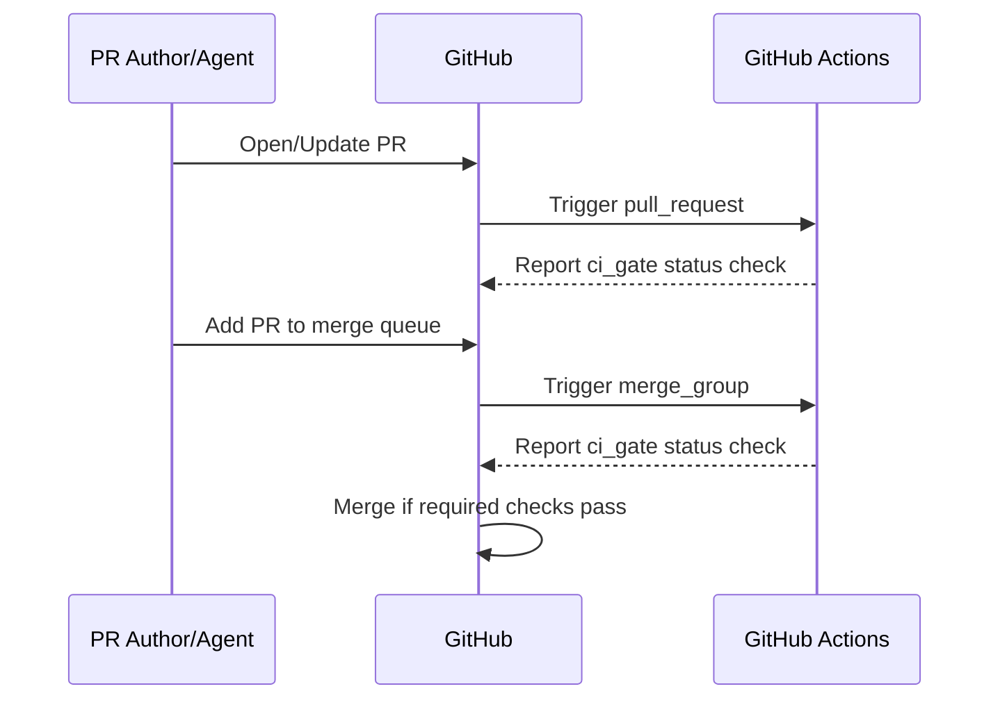

# ShortPulse Deep Dives for High-Concurrency Agent Development

## Executive summary

You’re now past the “generic best practices” phase and into **repo-specific governance engineering**. The items you listed cluster into three coupled systems: **(a) account/plan capability + enforcement proof**, **(b) a single, unskippable required CI gate compatible with merge queue**, and **(c) a local multi-worktree operating model that doesn’t melt Next.js/VS Code**. The most important technical facts that shape every deliverable here:

- **Merge queue requires `merge_group`** triggers in GitHub Actions for required checks; otherwise status checks won’t be reported when a PR is queued and merges will fail. citeturn2search0  
- Required-check semantics differ sharply between:
  - **Workflow skipped** (e.g., `paths`/`paths-ignore`): required checks stay **Pending** and block merging, and  
  - **Job skipped** (via job-level `if:`): job reports **Success** and will not block merges, even if selected as required. citeturn0search3turn1search3  
  This is the key reason to migrate to a **single required `ci_gate` job** in an always-triggering workflow.
- Git worktrees are the simplest local isolation boundary: Git explicitly supports multiple working trees so multiple branches can be checked out simultaneously. citeturn1search18  
- For Next.js specifically, dev builds output to `.next/dev`, reducing conflicts between dev and build runs; and you can set `distDir` if you need further isolation control. citeturn1search0turn1search1  

One practical constraint: I can’t read the local paths you referenced (e.g., `/Users/.../ShortPulse/.github/workflows/ci.yml`) or run authenticated “live checks” against your GitHub org from here. What I *can* do is give you an **auditable capability-probe script**, a **migration design** that is correct under GitHub’s documented semantics, and **drop-in templates** for SOPs and policy docs. If you paste/upload the referenced files later, I can produce precise diffs.

## Account-specific GitHub capability proof for your org and repo

### What “proof” should mean

For governance and waiver docs, “capability proof” should be **evidence you can re-run** and attach to a dated record:

- **Repo ownership + visibility** (org vs user; public vs private) because merge queue availability depends on this. citeturn7search19  
- **Rulesets API availability** (can you list rulesets? can you query rule-suite evaluations?) using GitHub’s REST API endpoints for rulesets and rule suites. citeturn2search1turn6search3  
- **Branch protection state** (required checks, review requirements) using the branch protection REST endpoints. citeturn7search2  
- **Merge queue availability**: GitHub’s docs are unambiguous that merge queues are available for public org repos, and for private org repos **only** on GitHub Enterprise Cloud. citeturn0search36turn7search19  
  Because there’s no universally reliable “plan/SKU” field exposed via a simple repository API response, the best proof is: **repo facts + documented eligibility + UI presence** (or admin confirmation) + optional GraphQL signal described below.

### A re-runnable capability probe script (read-only)

This is designed to be run from your ShortPulse repo root and generate a JSON artifact you can check into your evidence folder.

```bash
#!/usr/bin/env bash
# scripts/probe_github_capabilities.sh
set -euo pipefail

# Requirements: gh CLI authenticated with read access to repo (and ideally admin for full protection details).
# This script makes read-only calls.

origin_url="$(git remote get-url origin 2>/dev/null || true)"
if [[ -z "$origin_url" ]]; then
  echo "ERROR: no git origin remote found" >&2
  exit 2
fi

# Normalize owner/repo from origin (handles https and ssh).
# Examples:
#   git@github.com:OWNER/REPO.git
#   https://github.com/OWNER/REPO.git
owner_repo="$(echo "$origin_url" | sed -E 's#.*github\.com[:/]+([^/]+/[^/.]+)(\.git)?#\1#')"
owner="${owner_repo%%/*}"
repo="${owner_repo##*/}"

ts="$(date -u +%Y-%m-%dT%H:%M:%SZ)"

# Repo facts
repo_json="$(gh repo view "$owner/$repo" --json name,owner,visibility,isFork,defaultBranchRef 2>/dev/null || true)"

# Rulesets (REST)
rulesets_status="unknown"
rulesets_body=""
if rulesets_body="$(gh api -H "Accept: application/vnd.github+json" "repos/$owner/$repo/rulesets" 2>/dev/null)"; then
  rulesets_status="ok"
else
  # capture status code via -i (headers) if you want more forensic data
  rulesets_status="error"
fi

# Rule suites (REST) – evidence that rulesets are being evaluated (if present)
rule_suites_status="unknown"
rule_suites_body=""
if rule_suites_body="$(gh api -H "Accept: application/vnd.github+json" "repos/$owner/$repo/rulesets/rule-suites?per_page=5" 2>/dev/null)"; then
  rule_suites_status="ok"
else
  rule_suites_status="error"
fi

# Branch protection (REST) – requires admin for full details
default_branch="$(echo "$repo_json" | jq -r '.defaultBranchRef.name // empty' 2>/dev/null || true)"
protection_status="unknown"
protection_body=""
if [[ -n "$default_branch" ]]; then
  if protection_body="$(gh api -H "Accept: application/vnd.github+json" "repos/$owner/$repo/branches/$default_branch/protection" 2>/dev/null)"; then
    protection_status="ok"
  else
    protection_status="error"
  fi
fi

# Optional: GraphQL mergeQueue field existence / visibility.
# GitHub added merge queue API support via repository.mergeQueue historical changelog,
# but it may return null when not enabled or not eligible. Treat as "signal", not definitive.
mergequeue_status="unknown"
mergequeue_body=""
graphql_query='
query($owner:String!, $name:String!) {
  repository(owner:$owner, name:$name) {
    name
    isPrivate
    owner { __typename login }
    mergeQueue {
      __typename
    }
  }
}'
if mergequeue_body="$(gh api graphql -f query="$graphql_query" -f owner="$owner" -f name="$repo" 2>/dev/null)"; then
  mergequeue_status="ok"
else
  mergequeue_status="error"
fi

jq -n \
  --arg ts "$ts" \
  --arg origin "$origin_url" \
  --arg owner "$owner" \
  --arg repo "$repo" \
  --arg rulesets_status "$rulesets_status" \
  --arg rule_suites_status "$rule_suites_status" \
  --arg protection_status "$protection_status" \
  --arg mergequeue_status "$mergequeue_status" \
  --argjson repo_json "${repo_json:-null}" \
  --argjson rulesets_body "${rulesets_body:-null}" \
  --argjson rule_suites_body "${rule_suites_body:-null}" \
  --argjson protection_body "${protection_body:-null}" \
  --argjson mergequeue_body "${mergequeue_body:-null}" \
'{
  timestamp_utc: $ts,
  origin: $origin,
  repo: { owner: $owner, name: $repo, gh_repo_view: $repo_json },
  rulesets: { status: $rulesets_status, data: $rulesets_body },
  rule_suites: { status: $rule_suites_status, data: $rule_suites_body },
  branch_protection: { status: $protection_status, data: $protection_body },
  mergequeue_graphql_signal: { status: $mergequeue_status, data: $mergequeue_body }
}'
```

Why these endpoints are the right “proof surface”:

- Rulesets are explicitly managed via GitHub REST “rules” endpoints. citeturn2search1turn6search7  
- Rule suite evaluations are available via GitHub REST “rule suites” endpoints, including repository-level listings. citeturn6search3  
- Branch protection is exposed via the REST “branch protection” endpoints. citeturn7search2  
- Merge queue API support exists at the GraphQL repository level (`mergeQueue`), but GitHub community guidance indicates you generally can’t reliably determine whether merge queue is enabled for a specific protection rule purely through that schema; treat it as a signal and confirm via settings. citeturn7search7turn7search3  

### How to update your waiver/evidence docs using this output

For your referenced docs:

- `2026-02-20-branch-protection-required-check-mapping.md`  
- `2026-02-21-stg-06-prototype-waiver.md`

Update pattern I recommend:

- Add an “Evidence refresh” section with:
  - the probe JSON filename (e.g., `docs/planning/evidence/runtime/2026-03-20-gh-capabilities.json`),
  - the repo facts (owner type, private/public),
  - rule endpoints status (ok/error),
  - merge queue eligibility statement anchored to GitHub docs: private repo + org + Enterprise Cloud required. citeturn0search36turn7search19  

If the probe shows rulesets endpoints erroring (403/404), that is “capability proof” that rulesets are not available to your current permissions/plan, and your waiver stays valid. If it shows OK and you confirm rulesets exist and are enforced, you can tighten the waiver accordingly. citeturn2search1turn6search3  

## Single required `ci_gate` migration design for your existing CI

### Non-negotiable constraints from GitHub’s semantics

Your migration should be designed around these documented behaviors:

- If a **workflow** is skipped due to path filtering or other workflow-level filters, checks stay **Pending** and required checks block merging. citeturn0search3turn0search19  
- If a **job** inside a workflow is skipped by job-level `if:`, it reports **Success** and will not block merging, even if set as required. citeturn0search3turn1search3  
- A real-world footgun: if your “results”/gate job is skipped due to dependency failures, and *that* gate job is selected as required, merges can slip through with failed dependencies. Community and runner issues document variants of this, so the gate job must be forced to run with `if: always()`. citeturn1search15  

### Target end state

- Exactly **one** required status check: `ci_gate` (job name) inside a workflow (e.g., `ci-gate.yml`).  
- The workflow triggers on:
  - `pull_request` (fast path; selective jobs allowed), and  
  - `merge_group` (merge queue path; stricter). citeturn2search0  
- All other jobs are *inputs* to the gate; they may be conditional, but the gate reads their results and enforces policy.

### A concrete design that supports warn/enforce modes

This skeleton assumes:
- You already have “warn/enforce” concept in `ci-policy-checks.md`.
- You want the required check to fail only when enforcement conditions are met.

```yaml
# .github/workflows/ci-gate.yml
name: ci-gate

on:
  pull_request:
  merge_group:

concurrency:
  group: ci-gate-${{ github.event.pull_request.number || github.ref }}
  cancel-in-progress: true

jobs:
  plan:
    runs-on: ubuntu-latest
    outputs:
      mode: ${{ steps.mode.outputs.mode }}
      scope: ${{ steps.scope.outputs.scope }}
      is_merge_group: ${{ steps.ev.outputs.is_merge_group }}
    steps:
      - uses: actions/checkout@v4
        with:
          fetch-depth: 0

      - id: ev
        run: |
          if [[ "${{ github.event_name }}" == "merge_group" ]]; then
            echo "is_merge_group=true" >> "$GITHUB_OUTPUT"
          else
            echo "is_merge_group=false" >> "$GITHUB_OUTPUT"
          fi

      - id: mode
        run: |
          # Example: strict on merge_group, policy-driven on PRs
          if [[ "${{ github.event_name }}" == "merge_group" ]]; then
            echo "mode=enforce" >> "$GITHUB_OUTPUT"
          else
            # Read from repo config file if desired
            echo "mode=warn" >> "$GITHUB_OUTPUT"
          fi

      - id: scope
        run: |
          # Compute an approximate change scope.
          # Avoid workflow-level paths filters; do it here.
          # For merge_group, consider forcing broader scope because queue merges multiple PRs.
          echo "scope=default" >> "$GITHUB_OUTPUT"

  lint:
    needs: plan
    if: ${{ needs.plan.outputs.scope != 'docs-only' }}
    runs-on: ubuntu-latest
    steps:
      - uses: actions/checkout@v4
      - run: npm ci
      - run: npm run lint

  unit:
    needs: plan
    if: ${{ needs.plan.outputs.scope != 'docs-only' }}
    runs-on: ubuntu-latest
    steps:
      - uses: actions/checkout@v4
      - run: npm ci
      - run: npm test

  secret_scan_custom:
    needs: plan
    runs-on: ubuntu-latest
    steps:
      - uses: actions/checkout@v4
      - run: node scripts/check_secret_exposure.js

  ci_gate:
    # The *only* required check should correspond to this job.
    needs: [plan, lint, unit, secret_scan_custom]
    if: ${{ always() }}
    runs-on: ubuntu-latest
    steps:
      - name: Evaluate job results
        shell: bash
        run: |
          set -euo pipefail
          mode="${{ needs.plan.outputs.mode }}"
          # needs.<job>.result is 'success'|'failure'|'cancelled'|'skipped'
          # Gate logic: fail only in enforce mode.
          failed=false
          for j in lint unit secret_scan_custom; do
            r="$(jq -r '.needs["'"$j"'"].result' <<< '${{ toJson(needs) }}')"
            if [[ "$r" == "failure" || "$r" == "cancelled" ]]; then
              failed=true
            fi
          done

          if [[ "$failed" == "true" && "$mode" == "enforce" ]]; then
            echo "CI gate: enforce mode failure"
            exit 1
          fi

          echo "CI gate: pass (mode=$mode, failed=$failed)"
```

Why these specific choices:

- `merge_group` support is mandatory for merge queue correctness with Actions. citeturn2search0  
- A single required job avoids the “pending required workflow due to path filters” trap, because the workflow always runs. citeturn0search3turn0search19  
- Job-level conditionals are safe for cost control because skipped jobs report success; but you must not make your *required* job conditional. citeturn1search3  
- `concurrency` cancellation reduces CI blow-ups under many agent pushes. citeturn5search1  
- Dependency caching should be added inside the jobs where it matters (npm/pnpm/yarn) to reduce minutes and latency. citeturn5search2  

### Required-check mapping in branch protection/rulesets

Once this is deployed, configure **exactly one required status check**:
- Required check name: typically `ci-gate / ci_gate` (workflow name + job name) in GitHub UI.

This mapping should be recorded in your `docs/planning/ci-policy-checks.md` and in the branch protection evidence doc. The protection rule API surface is documented if you later want to automate evidence gathering. citeturn7search2  

## Merge queue cutover packet with rollback plan

### Preconditions and plan reality

- Merge queues are available for **public org repos**, or **private org repos on GitHub Enterprise Cloud**. citeturn0search36turn7search19  
- Merge queue is enabled by requiring it in branch protection (“Require merge queue”) for the base branch. citeturn7search1  
- Merge queue can’t be enabled if the branch protection pattern uses wildcard `*`. citeturn0search0  

### Cutover checklist

Technical checklist (do this before flipping “Require merge queue”):

1. **Ensure `ci-gate.yml` includes `merge_group`.** citeturn2search0  
2. **Ensure no required-check workflow uses workflow-level `paths` filters.** Otherwise checks can remain Pending and block or misbehave. citeturn0search3turn0search19  
3. **Ensure the only required check is `ci_gate`** (or your chosen stable gate job).  
4. **Add merge queue triggers for any additional security scanners that must run in queue**, e.g., code scanning. GitHub explicitly calls out `merge_group` for this use case. citeturn0search35turn2search0  
5. **Set up concurrency cancellation** for PR workflows to reduce backlog under agent volume. citeturn5search1  
6. **Run a dry-run PR**: confirm `ci_gate` reports a check on PR events and merge_group events (once queued). citeturn2search0  

Operational checklist (the change-management layer):

- Record “before” screenshots/JSON:
  - branch protection settings,
  - required checks list,
  - CI workflow run list (one PR).  
- Enable merge queue requirement. citeturn7search1  
- Observe first 3–5 merges for:
  - queue wait time,
  - re-run frequency,
  - false passes due to skipped gating.

### Rollback plan

If queue adoption causes blockage or unsafe merges:

- Disable “Require merge queue” in branch protection for the trunk branch (immediate). citeturn7search1  
- Keep `merge_group` triggers in workflows; they are harmless even when queue is off and reduce rework if you re-enable later. citeturn2search0  
- Revert required check mapping if you temporarily added more required checks.  
- If you used merge queue as a substitute for “require branches up to date,” re-enable strict up-to-date requirements until the queue is ready again (merge queue is designed to provide similar benefits without constant manual updating). citeturn7search13  

### Mermaid: merge queue + ci_gate event flow



## Worktree SOP and automation for ShortPulse with Next.js and VS Code

### Why worktrees are the correct local “agent isolation” boundary

Git worktrees are explicitly designed for multiple parallel working directories from one repo, allowing multiple branches to be checked out simultaneously. citeturn1search18  
VS Code documents built-in support for worktrees, including managing multiple branches/worktrees for parallel development. citeturn1search2  

For agent tooling, Codex specifically documents that it automatically creates worktrees (often in detached HEAD) to avoid polluting your branch list. citeturn1search37  

### Next.js-specific isolation and lock avoidance

- Next.js documents that dev builds output to `.next/dev` rather than `.next`, helping avoid conflicts between dev and build output. citeturn1search0  
- If you need stronger separation between environments (or to avoid collisions with tools that assume `.next`), Next.js supports a custom `distDir` to replace `.next`. citeturn1search1  

In practice, with one worktree per agent, `.next` is already isolated per worktree directory. The remaining common collision is **port conflicts**, solved by allocating distinct ports per worktree (`PORT=...`). citeturn1search0  

### Worktree SOP (human-readable)

Policy baseline:

- One agent branch per ticket: `agent/<agent>/<ticket>-<slug>`
- One worktree directory per agent branch: `../wt-<agent>-<ticket>`
- Every worktree runs dev server on a unique port.

Core commands are standard Git worktree operations. citeturn1search18  

```bash
# Create worktree for an agent branch
git worktree add -b agent/alice/1234-navbar ../wt-alice-1234 origin/main

# List worktrees
git worktree list

# Remove worktree
git worktree remove ../wt-alice-1234
git worktree prune
```

### In-repo automation: up/down/prune + port assignment + TTL policy

A pragmatic “one command per agent worktree” wrapper (extends the earlier probe concept):

```bash
#!/usr/bin/env bash
# scripts/wt
set -euo pipefail

cmd="${1:-}"
agent="${2:-}"
ticket="${3:-}"
slug="${4:-wip}"
base="${5:-origin/main}"

repo_root="$(git rev-parse --show-toplevel)"
branch="agent/${agent}/${ticket}-${slug}"
wt="${repo_root%/}/../wt-${agent}-${ticket}"

pick_port() {
  # deterministic-ish: hash branch, map to 3200-3999 (avoid common dev ports)
  python3 - <<'PY'
import hashlib, os
b=os.environ["BR"].encode()
h=int(hashlib.sha1(b).hexdigest(),16)
print(3200 + (h % 800))
PY
}

case "$cmd" in
  up)
    [[ -n "$agent" && -n "$ticket" ]] || { echo "usage: scripts/wt up <agent> <ticket> [slug] [base]"; exit 2; }
    git -C "$repo_root" fetch origin
    git -C "$repo_root" worktree add -b "$branch" "$wt" "$base"
    echo "Worktree: $wt"
    echo "Branch:   $branch"
    BR="$branch" PORT="$(BR="$branch" pick_port)"
    echo "Suggested dev: cd '$wt' && PORT=$PORT npm run dev"
    ;;
  down)
    git -C "$repo_root" worktree remove --force "$wt"
    git -C "$repo_root" worktree prune
    echo "Removed worktree: $wt"
    ;;
  prune)
    git -C "$repo_root" worktree prune
    ;;
  *)
    echo "usage: scripts/wt {up|down|prune} <agent> <ticket> [slug] [base]"
    exit 2
    ;;
esac
```

### TTL cleanup policy for agent branches and worktrees

Remote branch sprawl controls:

- Enable “Automatically delete head branches” so merged PR branches are deleted automatically. citeturn4search0  
- For stale/unmerged agent branches, implement a scheduled cleanup job using Git refs deletion endpoint. citeturn2search2  

A GitHub Action can:
- list branches matching `agent/`,
- check last commit date,
- delete refs older than TTL.

Ref deletion is supported via `DELETE /repos/{owner}/{repo}/git/refs/{ref}`. citeturn2search2  

Local worktree hygiene controls:
- Encourage developers/agents to remove worktrees after merge (`git worktree remove`, `git worktree prune`). citeturn1search18  

## Secrets hardening beyond regex: coverage map, push protection, and practical enforcement

### The minimum set of layers that holds up under AI commit volume

You already have a custom secret scanning script (`scripts/check_secret_exposure.js`). To make your security posture reviewable, build a coverage map across these independent layers:

1. **GitHub push protection**: blocks secrets at push time (prevents exposure), not merely detects them later. citeturn2search3turn2search7  
2. **GitHub secret scanning**: detects secrets in repo content/history and produces alerts; supported patterns are documented and change over time. citeturn4search31turn4search2  
3. **Local pre-commit/pre-push scanning** (agent workstation boundary): use tools like gitleaks + pre-commit to catch secrets before they reach GitHub. citeturn6search0turn5search3  
4. **CI gate enforcement**: your `ci_gate` should fail if secret scans fail (in enforce mode). This integrates with your single required-check design. citeturn0search3turn1search3  

### Why you need an explicit coverage map

- GitHub’s supported secret scanning patterns are enumerated publicly; anything not in this list is a “potential gap” unless you cover it with custom patterns or local scanning. citeturn4search2  
- Custom patterns exist, but GitHub documents important constraints: enabling push protection for custom patterns can require enterprise-level configuration and can be disruptive. citeturn4search14  

### Actionable deliverables to add to ShortPulse

1) A coverage map doc (recommended path): `docs/security/secret-scanning-coverage.md`

Suggested structure:

- Secret categories relevant to ShortPulse (examples: OAuth client secrets, DB URLs, JWT signing keys, third-party API keys)
- Detection/Prevention layer matrix:
  - `check_secret_exposure.js` (your script)
  - gitleaks (local + CI)
  - GitHub secret scanning alerts
  - GitHub push protection coverage (by pattern type)
  - any push rulesets (see below)

2) Add gitleaks locally via pre-commit

Pre-commit’s documented configuration mechanism is `.pre-commit-config.yaml`. citeturn5search3  
Gitleaks is explicitly designed to detect secrets in git repos and files. citeturn6search0  

3) Add GitHub secret scanning review action to CI

This action can fail a PR status check if a secret scanning alert is introduced, and is designed to be paired with rulesets to block merges. citeturn6search1  

4) Use push rulesets as a “seatbelt” for risky file paths

GitHub rulesets include push rulesets that can block pushes based on file paths/extensions/sizes and apply to every push (no branch targeting). citeturn6search2turn6search6  
This is especially valuable to block:
- `.env*`
- key material directories
- `.github/workflows/**` (unless explicitly allowed)
- large binary dumps

## Agent policy matrix for ShortPulse: allowed / ask / deny by tool

This section translates your “agent permission” goal into a concrete, enforceable policy stack for Codex, Gemini Code Assist, and VS Code agent sessions.

### Documented permission models you can rely on

- Codex: sandboxing + approvals model is explicitly documented; sandboxing defines boundaries and approvals gate risky actions. citeturn3search12turn3search0  
  Codex config docs also note that `.git/` and `.codex/` may be read-only even when workspace is writable (important for “agent can’t commit” expectations). citeturn3search24turn3search16  
- Gemini Code Assist: agent mode shows a plan for approval and asks for permissions during execution; Gemini CLI plan mode is explicitly read-only. citeturn3search2turn3search6  
  Gemini release notes also include “auto approve mode,” which is a major risk knob you should treat as off by default in this repo. citeturn3search30  
- VS Code agents: “Bypass Approvals” and “Autopilot” bypass manual approval prompts, including for destructive actions; only use with full understanding of the security implications. citeturn3search39  

Separately, GitHub’s recent changelog reinforces that auto-running workflows for agent changes is a conscious risk tradeoff because workflows can access secrets/tokens. citeturn3search23  

### Recommended “safe default” ShortPulse policy stack

Interpretation: “Allow” means pre-approved, “Ask” means human must approve per-run, “Deny” means blocked in all agent modes (human-only).

| Operation class | Default policy | Rationale under high agent concurrency |
|---|---|---|
| Read code, grep, list files | Allow | Low risk; needed for planning and review. |
| Edit application code under `apps/**`, `packages/**`, `src/**` | Ask → Allow (once scoped to a worktree) | Permit edits only within an isolated worktree to avoid cross-agent collision. citeturn1search18 |
| Run tests, lint, typecheck | Allow (in worktree) | Safe and improves correctness; use CI gate as required check. citeturn0search3turn1search3 |
| Network access from agents | Ask (or Deny for most sessions) | Prevent exfiltration and supply-chain surprises; align with plan/read-only defaults. citeturn3search0turn3search6 |
| Modify `.github/workflows/**` | Deny (agent), Ask (human-only with CODEOWNERS) | Workflow edits can change secret access and CI behavior; treat as high risk. citeturn3search39turn3search23 |
| Run migrations / deploy scripts | Ask (human approval required) | High blast radius; requires environment context. |
| `git commit` | Ask (agent drafts message; human confirms) | Preserve provenance and avoid accidental staging of secrets. |
| `git push` / opening PRs | Ask (human confirmation) | Remote write operation; tie to review and required checks. |
| Enable “autopilot / bypass approvals” modes | Deny in normal dev; allow only in sandboxed, no-secrets environments | VS Code explicitly warns about bypassing approvals. citeturn3search39 |

### Tool-specific enforcement hooks

- Codex: enforce sandbox boundaries and require approvals for network and high-risk commands per the approvals/security model; be aware `.git` read-only constraints may prevent in-agent commits. citeturn3search0turn3search24  
- Gemini: keep plan mode for analysis tasks (read-only) and explicitly disable auto-approve in ShortPulse contexts. citeturn3search6turn3search30  
- VS Code: do not enable bypass approvals for sessions that can access repo secrets; this is explicitly a security risk. citeturn3search39  

---

If you paste or upload the referenced repository files (`.github/workflows/ci.yml`, `docs/planning/ci-policy-checks.md`, `scripts/check_secret_exposure.js`, and the two evidence/waiver docs), I can turn the designs above into exact, line-level patches: the `ci_gate` workflow minimal diff, the updated policy doc wording, and a finalized coverage map tailored to your existing secret regex gates and CI job taxonomy.
